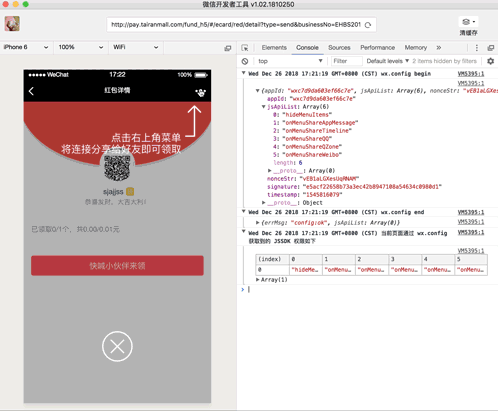
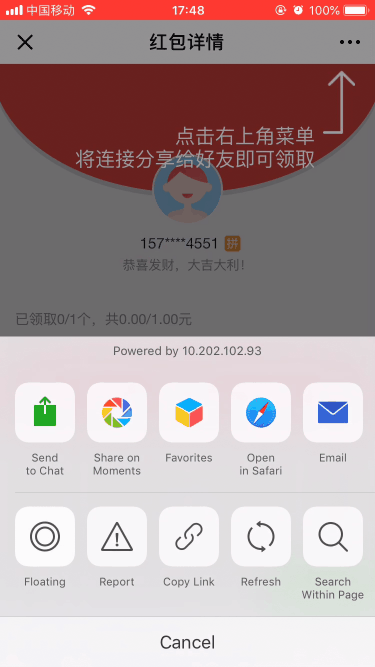

### 微信分享测试环境分享
- 【问题】：在测试环境中，微信分享分享给好友的链接是当前页面的链接，期望为接口返回的特定链接。
- 【解决】：
    1. 在测试反馈给我这个问题的时候，我先去正式环境看了一下，没有这个问题。
    2. 回想了一下近期代码的更改，也没有涉及到相关的更改。
    3. 得出初步结论：可能是测试环境配置的问题，造成分享不正确。不过虽然大概率是测试配置原因，问题还是需要定位的，看什么原因造成测试环境有问题。连上
    4. 连上抓包软件charles，进行查看，发现getJSApi返回502，这个接口的完整地址是`https://wx.tairanmall.com/getJSApi`。所以应该是测试的代理不对。果然，连上了以后就请求通了。
    5. 以为这样就可以了。但是我还是太天真了。虽然在微信开发者工具中，分享一切正常！但是在手机中，还是有问题，分享不出去！
    6. 暂定是getJSApi返回的信息有问题。过了一天，测试通过了，但是没有任何改动。。。emmmmm

    
    

    从上述gif中可以看到，开发者工具中，可以正确获取到分享标题等信息。而且在控制台中可以看到相关操作例如取消和发送的时候，打印出的信息。而在手机微信中，控制台中是没有信息的。而且接口也都是获取到的。基本上问题就集中在下面代码中。

    我们在手机中alert(mainTitle)，alert(url)，都有弹窗出来。而在wx.onMenuShareAppMessage这一步就走不通了。暂定疑问在wx.config中，因为getJSApi接口返回的数据，不能被wx.config通过。

    ```js
    wx.config({
        debug: false, // 开启调试模式,调用的所有api的返回值会在客户端alert出来，若要查看传入的参数，可以在pc端打开，参数信息会通过log打出，仅在pc端时才会打印。
        appId: res.data.appId, // 必填，公众号的唯一标识
        timestamp: res.data.timestamp, // 必填，生成签名的时间戳
        nonceStr: res.data.nonceStr, // 必填，生成签名的随机串
        signature: res.data.signature,// 必填，签名，见附录1
        jsApiList: [
            'hideMenuItems',
            'onMenuShareAppMessage',
            'onMenuShareTimeline',
            'onMenuShareQQ',
            'onMenuShareQZone',
            'onMenuShareWeibo'
        ] // 必填，需要使用的JS接口列表，所有JS接口列表见附录2
    });
    wx.ready(function(){
        wx.onMenuShareAppMessage({
            title: mainTitle, // 分享标题
            desc: subTitle, // 分享描述
            link: url,// 分享链接，该链接域名或路径必须与当前页面对应的公众号JS安全域名一致
            imgUrl: imgUrl, // 分享图标
            type: '', // 分享类型,music、video或link，不填默认为link
            dataUrl: '', // 如果type是music或video，则要提供数据链接，默认为空
            success: function () {
                // 用户确认分享后执行的回调函数

            },
            cancel: function () {
                // 用户取消分享后执行的回调函数

            },
            fail: function () {
                // 用户取消分享后执行的回调函数

            }
        });
        wx.onMenuShareTimeline({
            title: mainTitle, // 分享标题
            link: url, // 分享链接，该链接域名或路径必须与当前页面对应的公众号JS安全域名一致
            imgUrl: imgUrl, // 分享图标
            success: function () {
                // 用户确认分享后执行的回调函数
            },
            cancel: function () {
                // 用户取消分享后执行的回调函数
            }
        });
        wx.onMenuShareQQ({
            title: mainTitle, // 分享标题
            desc: subTitle, // 分享描述
            link: url, // 分享链接
            imgUrl: imgUrl, // 分享图标
            success: function () {
                // 用户确认分享后执行的回调函数
            },
            cancel: function () {
                // 用户取消分享后执行的回调函数
            }
        });
        wx.onMenuShareWeibo({
            title: mainTitle, // 分享标题
            desc: subTitle, // 分享描述
            link: url, // 分享链接
            imgUrl: imgUrl, // 分享图标
            success: function () {
                // 用户确认分享后执行的回调函数
            },
            cancel: function () {
                // 用户取消分享后执行的回调函数
            }
        });
        wx.onMenuShareQZone({
            title: mainTitle, // 分享标题
            desc: subTitle, // 分享描述
            link: url,  // 分享链接
            imgUrl: imgUrl, // 分享图标
            success: function () {
                // 用户确认分享后执行的回调函数
            },
            cancel: function () {
                // 用户取消分享后执行的回调函数
            }
        });
    });
    ```
