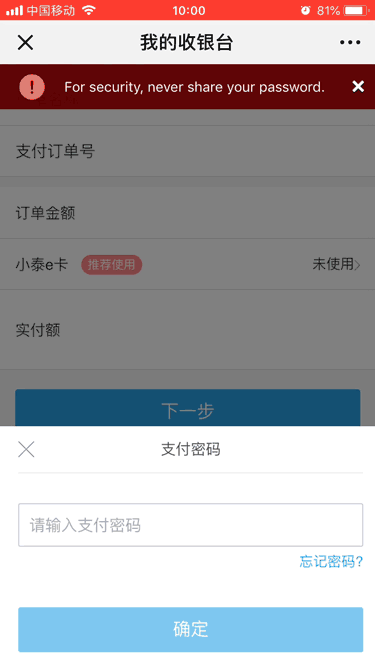
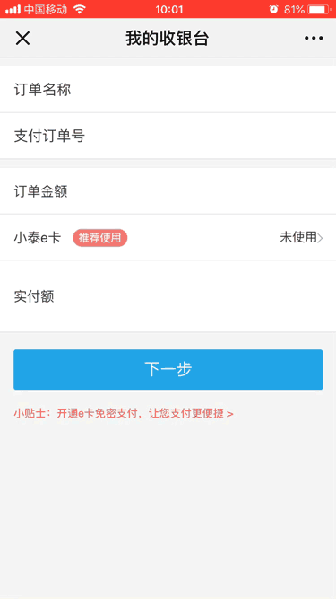
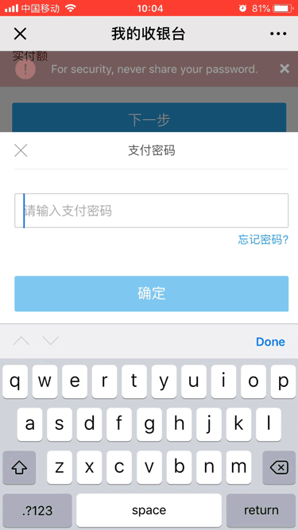

### 微信端autofocus虚拟键盘弹出拉高页面

可以看到在微信端打开我的收银台页面，点击下一步时，会弹出支付密码弹窗，再点击关闭的时候，整个页面都会向上滑。这显然是不正常的。



首先采用的方法是，input失去焦点或者点击支付密码弹窗左上角X的时候，使用scrollTop定位到页面顶部。

```js
document.documentElement.scrollTop = document.body.scrollTop = 0
```


可以看到画面更加魔幻了。有一个页面被虚拟键盘向上推起，又被scroll拉下来的动画。

同时，我们也有一个疑问，为什么我们明明只是关闭了支付密码的弹窗，会有虚拟键盘弹出来，拉高页面。看了弹窗的相关代码。

```js
<input type="password" placeholder="请输入支付密码" onChange={this.handleChange.bind(this)}  autoFocus />
```

从代码中可以看到，input中有autoFocus，可以自动聚焦，并唤起虚拟键盘。

查阅资料可知：IOS下input的获取焦点存在这样的问题

> 来自FastClick团队的大牛指出了IOS下input的获取焦点存在这样的问题：my colleagues and I found that iOS will only allow focus to be triggered on other elements, from within a function, if the first function in the call stack was triggered by a non-programmatic event. In your case, the call to setTimeout starts a new call stack, and the security mechanism kicks in to prevent you from setting focus on the input.



最后采用的方案是微信中不自动聚焦。判断是否在微信浏览器中`navigator.userAgent.toLowerCase().includes('micromessenger')`，如果是的话，就将autoFocus设为false。
