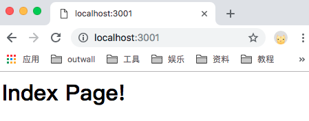
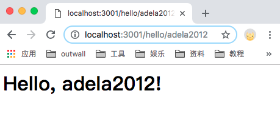

# Koa入门

## 介绍
> Koa 通过 node.js 实现了一个十分具有表现力的 HTTP 中间件框架，力求让 Web 应用开发和 API 使用更加地愉快。Koa 的中间件之间按照编码顺序在栈内依次执行，允许您执行操作并向下传递请求（downstream），之后过滤并逆序返回响应（upstream）。

## 创建Koa
首先创建一个文件夹 [**learn-koa**](https://github.com/Adela2012/blog/tree/master/learn-koa) 作为项目文件夹。

先初始化`npm init`来创建一个`package.json`文件。

然后输入`npm install koa --save`来将它保存在`package.json`中。

```javascript
{
  "name": "learn-koa",
  "version": "1.0.0",
  "description": "",
  "main": "index.js",
  "scripts": {
    "test": "echo \"Error: no test specified\" && exit 1"
  },
  "author": "",
  "license": "ISC",
  "dependencies": {
    "koa": "^2.6.1"
  }
}

```

创建一个`hello.js`文件， 输入以下代码，再在终端输入 `node hello`，这时就起了一个端口为3000的服务，可以在浏览器中用`localhost:3000`打开。

```javascript
const Koa = require('koa')
const app = new Koa()

app.use(ctx => {
  ctx.body = 'hello koa'
})

app.listen(3000)
```

## 上下文
> Koa Context 将 node 的 request 和 response 对象封装到单个对象中，为编写 Web 应用程序和 API 提供了许多有用的方法。 这些操作在 HTTP 服务器开发中频繁使用，它们被添加到此级别而不是更高级别的框架，这将强制中间件重新实现此通用功能。

每个请求都将创建一个 Context，并在中间件中作为接收器引用，或者 ctx 标识符，如以下代码片段所示：

```javascript
app.use(async ctx => {
  ctx; // 这是 Context
  ctx.request; // 这是 koa Request
  ctx.response; // 这是 koa Response
});
```

## 处理URL
集中处理URL，根据不同的URL调用不同的处理函数，这样，我们才能专心为每个URL编写处理函数。

通过`npm install koa-router --save`，在项目中引入`koa-router`，让它处理URL映射。新建`router.js`文件。

### 处理GET请求
可以用`router.get('/path', async fn)`来进行get请求。

```javascript
const Koa = require('koa')
const router = require('koa-router')() // 函数调用
const app = new Koa()

app.use(async (ctx, next) => {
  console.log(`Process ${ctx.request.method} ${ctx.request.url}...`)
  await next()
})

router.get('/', async (ctx, next) => {
  var name = ctx.params.name
  ctx.response.body = `<h1>Index Page!</h1>`
})

router.get('/hello/:name', async (ctx, next) => {
  var name = ctx.params.name
  ctx.response.body = `<h1>Hello, ${name}!</h1>`
})

app.use(router.routes())

app.listen(3001)

```

在终端输入`node router.js`

- 在浏览器中打开`localhost:3001`



- 在浏览器中打开`localhost:3001/hello/adela2012`



### 处理POST请求

可以用`router.post('/path', async fn)`来处理post请求。
通过`npm install koa-bodyparser --save`，在项目中引入`koa-bodyparser`，让它处理POST请求的reqest的body内容，解析出的参数绑定到`ctx.request.body`中。

<br>

---------------

参考链接：

- [Koa-廖雪峰的官方网站](https://www.liaoxuefeng.com/wiki/001434446689867b27157e896e74d51a89c25cc8b43bdb3000/001434501579966ab03decb0dd246e1a6799dd653a15e1b000)
- [Koa 文档](https://demopark.github.io/koa-docs-Zh-CN/)
- [Koa github地址](https://github.com/koajs/koa)

