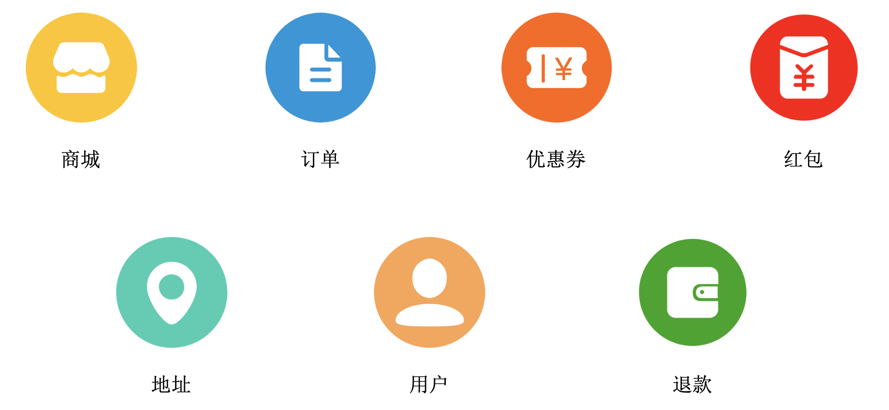
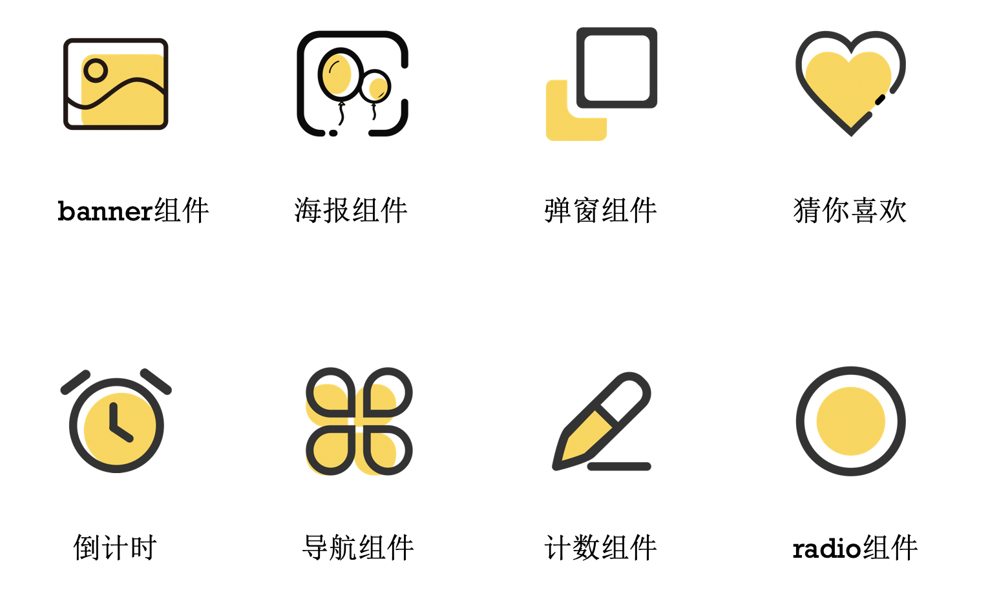
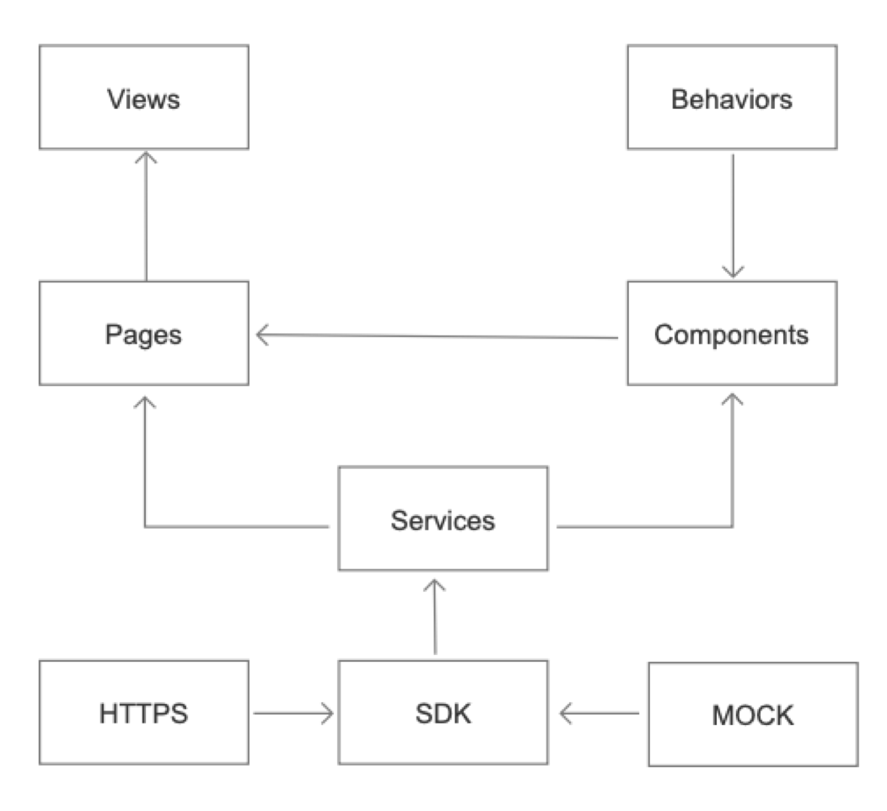

# 优选项目前端架构浅谈

前些日子，在架构师带领下，我和绿哥从零开始开发小泰优选拼团微信小程序。这是一个比较完整的项目开发，从以下几个点，我对该项目的架构进行一些分析和介绍。

由于本人能力有限，可能会有缺漏和错误，欢迎指出。

<br>
<br>

## 目录
1. <a href="#project">项目介绍</a>
2. <a href="#stucture">项目结构</a>
3. <a href="#component">组件化开发</a>
4. <a href="#http">HTTP请求封装</a>
5. <a href="#document">文档书写</a>
6. <a href="#summary">总结</a>

<br>
<br>


## 内容

<br>

### <a name="project">1. 项目介绍</a>

小泰优选拼团是一个轻量的小程序，全部由原生小程序页面组成，共23个页面。我们将之划分为7个模块，用户、地址、优惠券、团购商城、订单、红包、退款。



项目初始是只有产品原型，服务端开发、UI设计、前端开发是同步进行的。一开始，我们是按照原型进行架构和页面开发，UI设计图和服务端接口后面陆陆续续提供出来的时候，我们再进行修改，这边会有一个很重要的，就是mock数据，这个会在后面讲到。

<br>


### <a name="stucture">2. 项目结构</a>

小泰优选拼团的项目结构主要分为公用组件、图片资源、页面、数据格式处理、工具类。

```
 ├─ components（公用组件）
 ├─ images（图片资源）
 ├─ libs（库）
 │   ├─ mock.js（mock数据）
 │   ├─ sdk.js（接口封装）
 ├─ pages（页面）
 │   ├─ account（用户相关）
 │   ├─ address（地址相关）
 │   ├─ coupon（优惠券相关）
 │   ├─ group（团购商城相关）
 │   ├─ order（订单相关）
 │   ├─ redPackage（红包相关）
 │   └─ refund（退款相关）
 ├─ service（数据格式处理）
 └─ utils（工具类）
     ├─ public.js
     └─ request.js
```

<br>

### <a name="component">3. 组件化开发</a>

大家都知道，组件化开发有很多好处。
- 组件复用，代码量少，提高编译速度。
- 组件的逻辑独立，修改不会影响其它文件。
- 文件结构清楚，方便其他人员的使用。

不过，如果组件设计不合理，业务拆分不对，也会造成重复代码、组件通信混乱和多工作量等问题。这个就需要项目开发者统筹全局，进行分析判断。
所以，我们研究了原型图，分析其中的功能模块和业务模块，我们将相同或可复用的模块提取出来，放到全局组件库下。同时，我们将单个模块也进行了组件化拆分，放在各自的模块组件库下。

目前公用组件大致有这几个：


在模块中，我们在页面中也抽了一些逻辑相对独立的代码出来，写成组件，有些是可以复用，有些单纯就是为了页面可读性高些。复用举例：在订单详情和订单列表中，有关订单的状态及功能按钮是一致的，我们就将这一块抽了出来，写成behaviors。可读性举例：确认订单页中，选择红包的弹窗，就单独写成组件，只要将红包选择的最终结果传给父组件就行，两者的边界很清晰。

<br>

### <a name="http">4. HTTP请求封装</a>

微信小程序进行网络通信，要先设置域名，不然会提示不合法。设置域名的信息可以在开发者工具-详情-域名信息中看到。

使用`wx.request`可以发起一个`http`请求

```js
wx.request({
  url: 'test.php', // 开发者服务器接口地址
  data: { // 请求的参数
    x: '',
    y: ''
  },
  method: 'GET', // HTTP 请求方法, 默认GET
  header: { // 设置请求的 header
    'content-type': 'application/json', // 默认值
    'cookie': 'token=' + token
  },
  dataType: 'json', // 返回的数据格式, 默认json
  responseType: 'text', // 响应的数据类型, 默认text
  success (res) { // 接口调用成功的回调函数
    console.log(res.data)
  },
  fail () {
    // 接口调用失败的回调函数
  },
  complete () {
    // 接口调用结束的回调函数（调用成功、失败都会执行）
  } 
})
```

在平时项目使用中，我们往往会对HTTP请求做一层封装。



从图中可以看到，在自定义的SDK中封装HTTPS请求的数据或MOCK的数据。在各个七个模块的services中分派，然后再在页面pages或者组件components中调用。

0. request模块封装，方便网络请求。
1. 定义了一个名为SDK的类，集成所有接口获取的方法。
2. 在app.js中，将初始化后的sdk赋值globalData.API_SDK。
3. Services中获取globalData.API_SDK对象实例中的接口方法，并导出。
4. 在页面中引用Services中的方法，并调用方法。

<br>

【详细内容】：

0. request模块封装，方便网络请求。

```js
// request.js

/**
 *
 * @param method 请求方式
 * @param url 请求地址
 * @param data 参数
 * @param options
 * {
 *   header : 'Object ; 请求头信息',
 *   withToken : 'Boolean ; 接口是否校验登录状态 ; 默认校验 , false 时不校验',
 *   showToast : 'Boolean ; 请求失败时，是否弹出失败原因 ; 默认显示 , false 时隐藏'
 *   showLoading : 'Boolean ; 请求中时，是否显示loading加载框 ; 默认隐藏 , true 时显示'
 * }
 */
const request = (method, url, data = {}, options = {}) => new Promise((resolve, reject) => {
  if (options.withToken !== false) {
    pendingRequestQueue.push({ url, method, data, options, resolve, reject });
    processQueueRequest(pendingRequestQueue);
  } else {
    directRequest({ url, method, data, options, resolve, reject })
  }
});


```
以上代码中我们可以看到request对于此接口是否需要token进行了判断，如果不需要token，直接请求，如果需要token，则加到`pendingRequestQueue`队列中。

```js
// request.js

/**
 * request queue
 */
function processQueueRequest() {
  if (getToken()) {
    for (; processingQueueRequestCounter < MAX_CONCURRENCY_PROCESS_QUEUE_REQUEST && pendingRequestQueue.length > 0;) {
      processingQueueRequestCounter++;
      directRequest(Object.assign({}, pendingRequestQueue.shift(), { isFromQueue: true }));
    }
  }
}
```

在processQueueRequest方法中，在能获取到token的情况下，将`pendingRequestQueue`队列中的请求一次出队，进行调用。

<br>

1. 定义了一个名为SDK的类，集成所有接口获取的方法。

```js
// sdk.js
import { mockSdk } from './mock';

// 服务器地址
const HOST = 'https://www.****.com/api';

// 订单模块名
const APP_ORDERS = '****-orders';

/**
 * @param path 接口路径
 * @returns {string} 订单模块对应接口地址
 */
const ordersUrl = (path) => [HOST, APP_ORDERS, path].join('/');

export class sdk {

  constructor(request, update = {}, env) {
    this.request = request;
    this.update = update;
    if (env !== 'production') this.mockSDK = new mockSdk();
  };

  /**
   * 获取订单列表
   * @param apiParams
   * {
   *   pageNum: '[Number]: 分页-页码',
   *   pageSize: '[Number]: 分页-条数',
   *   ordersState: '[String]: 状态'
   * }
   * @returns {Promise<any>}
   * total: '[Number]: 总页数',
   * list:[
   *   {
   *     orderId: '[String]: 订单id',
   *     goodList: [ // 购买商品列表
   *       {
   *         goodsId: '[String]: 商品id',
   *         goodsName: '[String]: 商品名称',
   *         ...
   *       },
   *       ...
   *     ],
   *     expressInfo: {
   *       expressNo: '[String]: 物流单号',
   *       ...
   *     },
   *   },
   *   ...
   * ]
   *
   */
  getOrderList = (apiParams = {}) => {
    const { getOrderList = {} } = this.update, { config = {} } = getOrderList, {
      method = 'POST',
      url = ordersUrl('orders/list'),
      data = 'page=${{pageNum}}&pageSize=${{pageSize}}&ordersState=${{orderState}}',
      options = {}
    } = config;

    const { hasMock = false } = apiParams;

    return this.mockSDK && hasMock ? this.mockSDK.getPayInfo(apiParams) : new Promise((resolve, reject) => requestFormat(this.request, method, url, data, options, apiParams)
      .then(res => resolve({
        total: res.pageEntity.totalPage,
        list: res.ordersPayVoList.map(order => (
          {
            orderId: order.ordersId,
            goodList: order.ordersGoodsVoList.map(data => ({
              goodsId: data.goodsId,
            })),
            expressInfo: {
              expressNo: order.shipSn
            },
          }
        )),
      }))
      .catch(errRes => reject(errRes)))
  };
}
```

在sdk.js中，我们可以看到在最开始引入了Mock的数据，可以通过`this.mockSDK && hasMock`来控制使用HTTPS请求的数据或者MOCK的数据。在此例子中，可以看到`获取订单列表`的获取的字段，我们进行了包装。这样做有几个好处：
- 在后端接口还没提供时，前端通过mock数据进行模拟，如果与最终接口字段不同，在SDK中修改就行。
- 接口有些数据返回的格式和层级，并不是前端需要的，可以在SDK中统一修改成前端想要的格式和层级。
- 后续版本或者维护中，接口返回字段不同，直接在sdk中修改，不用在页面中查找修改。
- 此接口可以提供给其他平台对接，并不局限于一个平台。

<br>


2. 在app.js中，将初始化后的sdk赋值globalData.API_SDK。

```js
// app.js
App({
  ...,
  onShow: function () {
    this.globalData.API_SDK = new sdk(request,  storage.getSync('api-version')
  },
  globalData: {
    API_SDK: {}
  }
})
```

在app.js的onShow方法中，通过new命令生成对象实例，并赋值globalData.API_SDK。

<br>


3. Services中获取globalData.API_SDK对象实例中的接口方法，并导出。

```js
// order.service.js
// 获取订单列表
const getOrderList = (apiParams) => getApp().globalData.API_SDK.getOrderList(apiParams);
export {
  getOrderList
}
```

有很多个service模块，order是service模块下其中一个，这样项目结构很清晰。

<br>

4. 在页面中引用Services中的方法，并调用方法。

```js
// pages/order/myList/myList.js
import { getOrderList } from '../../../service/order.service';
Page({
  /**
   * 获取初始数据
   */
  getInitData() {
    let { pageNum } = this.data
    getOrderList({ pageNum, pageSize: 10, orderState: 'all' }).then(res => {
      this.setData({
        lists: this.data.lists.concat(res.list),
        totalPage: res.total
      })
    })
  },
})
```

在页面中，引入service的getOrderList方法，并调用，赋值给当前页面data。

<br>

### <a name="document">5. 文档书写</a>

> 软件开发文档是软件开发使用和维护过程中的必备资料。它能提高软件开发的效率，保证软件的质量，而且在软件的使用过程中有指导，帮助，解惑的作用，尤其在维护工作中，文档是不可或缺的资料。

在项目中，我们维护了两份文档，分别为API文档和组件README文档。
在API文档中，将每次SDK修改的内容都写在文档中，标注`版本、时间、说明`。并说明SDK接口的使用方式、传参说明、API响应说明等。在README文档中，则写明目录结构说明和全局组件说明。这样，开发者就可以通过文档来比较方便的了解此项目的情况。

### <a name="summary">6. 总结</a>

在写这个项目前，新零售前端约定了小程序开发规范。明确了页面、命名、样式、行为等规范。因此，在开发过程中，我们格外注意开发的风格，尽量做到统一。

在原型出来以后，架构师根据优选的原型图进行了模块和功能的划分，明确了每个人所做的开发内容，制定了前端开发排期。

在开发过程中，因为UI图还没出来，我们根据原型图先进行了开发，后来在修改样式的时候，感觉还是挺麻烦的。不过，虽然存在样式返工问题，但是加快了后续的开发速度。

因为架构师封装了全部的接口到SDK中，并且跟后端程序员约好了数据内容，我们在对接的时候方便了很多，速度也快了很多。同时，在调试对接的时候，也修改了一些缺乏的字段服务端没有提供或者SDK没有包的，这个我们后续加进去的，在API文档说明都有做修改内容说明（所以多人协作时，文档真的很重要）。

这个项目前期很慢，后期很快。快到项目上线日期了，其实我们有些接口还没调完（测试已经在陆陆续续测试我们已经写好的模块了），感觉挺着急的，虽然上线日期定的5月10日，架构师说可以延期的，不过很神奇的是，我们竟然真的如约上了。

这是我写的第二个小程序的项目，是完整的整一个项目。前一个小程序项目只写了一个小模块，因此感觉成长还是挺大的。比较其他以往的开发项目，类似vue、react、支付宝小程序，感觉开发框架都是大同小异的，基本理念和流程都大致相似，只是开发语言或方法的实现有所差异。
