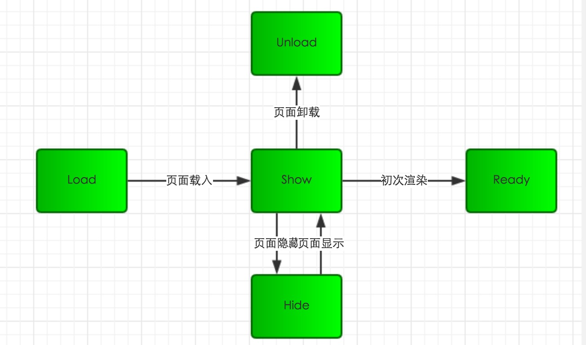
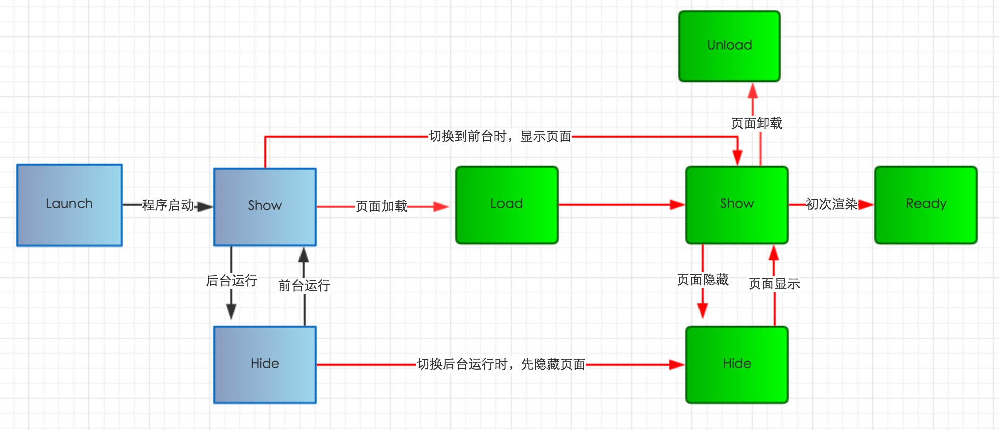

# 小程序理解与踩坑

> 创建时间: 2018-11-27


### 目录

- 一、小程序项目结构
- 二、小程序生命周期
- 三、小程序HTTP请求
- 四、小程序跳转H5
- 五、H5跳转小程序
- 六、小程序分享


<br>

## 一、小程序项目结构

- JSON 页面配置
- WXML 模板结构
- WXSS 页面样式
- JS   脚本逻辑

<br>

## 二、小程序生命周期

小程序分为应用和页面两个部分，所以小程序的生命周期涉及以下：

- 应用的生命周期
- 页面的生命周期
- 应用的生命周期对页面生命周期的影响

### （1）应用的生命周期
`App()` 函数用来注册一个小程序。接受一个 `Object` 参数，其指定小程序的生命周期回调等。<br>
`App()` 必须在 `app.js` 中调用，必须调用且只能调用一次。

```js
App({
  onLaunch: function(options) {
    // 监听小程序初始化。小程序初始化完成时（全局只触发一次）
  },
  onShow: function(options) {
    // 监听小程序显示。小程序启动，或从后台进入前台显示时
  },
  onHide: function() {
    // 监听小程序隐藏。小程序从前台进入后台时。
  },
  onError: function(msg) {
    console.log(msg) // 错误监听函数。小程序发生脚本错误，或者 api 调用失败时触发，会带上错误信息
  },
  onPageNotFound: function(res) {
    // 页面不存在监听函数。小程序要打开的页面不存在时触发，会带上页面信息回调该函数
  },
  globalData: 'I am global data'
})
```
**前台、后台定义**： 当用户点击左上角关闭，或者按了设备 Home 键离开微信，小程序并没有直接销毁，而是进入了后台；当再次进入微信或再次打开小程序，又会从后台进入前台。


<p style="text-align:center;color:#999;">图：应用生命周期</p>

1. 用户首次打开小程序，触发 onLaunch 方法（全局只触发一次）。
2. 小程序初始化完成后，触发 onShow 方法，监听小程序显示。
3. 小程序从前台进入后台，触发 onHide 方法。
4. 小程序从后台进入前台显示，触发 onShow 方法。
5. 小程序后台运行一定时间，或系统资源占用过高，会被销毁。

全局的 `getApp()` 函数可以用来获取到小程序 `App` 实例。

```js
// other.js
var appInstance = getApp()
console.log(appInstance.globalData) // I am global data
```

**注意：** 

- 不要在定义于 App() 内的函数中调用 getApp() ，使用 this 就可以拿到 app 实例。
- 通过 getApp() 获取实例之后，不要私自调用生命周期函数。


### （2）页面的生命周期

`Page(Object) `函数用来注册一个页面。接受一个 `Object` 类型参数，其指定页面的初始数据、生命周期回调、事件处理函数等。

```js
//index.js
Page({
  data: {
    // 页面的初始数据
    text: "This is page data."
  },
  onLoad: function(options) {
    // 生命周期回调—监听页面加载
  },
  onReady: function() {
    // 生命周期回调—监听页面初次渲染完成
  },
  onShow: function() {
    // 生命周期回调—监听页面显示
  },
  onHide: function() {
    // 生命周期回调—监听页面隐藏
  },
  onUnload: function() {
    // 生命周期回调—监听页面卸载
  },
  onPullDownRefresh: function() {
    // 监听用户下拉动作
  },
  onReachBottom: function() {
    // 页面上拉触底事件的处理函数
  },
  onShareAppMessage: function () {
    // 用户点击右上角转发
  },
  onPageScroll: function() {
    // 页面滚动触发事件的处理函数
  },
  onResize: function() {
    // 页面尺寸改变时触发
  },
  onTabItemTap(item) {
    // 当前是 tab 页时，点击 tab 时触发
    console.log(item.index)
    console.log(item.pagePath)
    console.log(item.text)
  },
  // 任意的函数，在页面的函数中用 this 可以访问
  viewTap: function() {
    this.setData({
      text: 'Set some data for updating view.'
    }, function() {
      // this is setData callback
    })
  },
  // 任意数据，在页面的函数中用 this 可以访问
  customData: {
    hi: 'MINA'
  }
})
```

<!--  -->

<p style="text-align:center;color:#999;">图：页面生命周期</p>

图：页面生命周期

- 小程序注册完成后，加载页面，触发onLoad方法。
- 页面载入后触发onShow方法，显示页面。
- 首次显示页面，会触发onReady方法，渲染页面元素和样式，一个页面只会调用一次。
- 当小程序后台运行或跳转到其他页面时，触发onHide方法。
- 当小程序有后台进入到前台运行或重新进入页面时，触发onShow方法。
- 当使用重定向方法wx.redirectTo(object)或关闭当前页返回上一页wx.navigateBack()，触发onUnload。

**总结**

- `onLoad`:   页面加载。一个页面只会调用一次。参数可以获取`wx.navigateTo`和`wx.redirectTo`及`<navigator/>`中的 `query`。
- `onShow`:   页面显示。每次打开页面都会调用一次。
- `onReady`:  页面初次渲染完成。一个页面只会调用一次，代表页面已经准备妥当，可以和视图层进行交互。对界面的设置如`wx.setNavigationBarTitle`请在`onReady`之后设置。
- `onHide`:   页面隐藏。当`navigateTo`或底部`tab`切换时调用。
- `onUnload`: 页面卸载。当`redirectTo`或`navigateBack`的时候调用。


 **Page 实例的生命周期**

<!--  -->

<p style="text-align:center;color:#999;">图：实例生命周期</p>

小程序由两大线程组成：负责界面的视图线程（view thread）和负责数据、服务处理的服务线程（appservice thread），两者协同工作，完成小程序页面生命周期的调用。

视图线程有四大状态：

1. 初始化状态：初始化视图线程所需要的工作，初始化完成后向 “服务线程”发送初始化完成信号，然后进入等待状态，等待服务线程提供初始化数据。
2. 首次渲染状态：当收到服务线程提供的初始化数据后（json和js中的data数据），渲染小程序界面，渲染完毕后，发送“首次渲染完成信号”给服务线程，并将页面展示给用户。
3. 持续渲染状态：此时界面线程继续一直等待“服务线程”通过this.setdata（）函数发送来的界面数据，只要收到就重新局部渲染，也因此只要更新数据并发送信号，界面就自动更新。
4. 结束状态：页面被回收或者销毁、应用被系统回收、销毁时触发。

服务线程五大状态：

1. 初始化状态：此阶段仅启动服务线程所需的基本功能，比如信号发送模块。系统的初始化工作完毕，就调用自定义的onload和onshow，然后等待视图线程的“初始化完成”。onload是只会首次渲染的时候执行一次，onshow是每次界面切换都会执行。
2. 等待激活状态：接收到“视图线程初始化完成”信号后，将初始化数据发送给“视图线程”，等待视图线程完成初次渲染。
3. 激活状态：收到视图线程发送来的“首次渲染完成”信号后，就进入激活状态既程序的正常运行状态，并调用自定义的onReady()函数。此状态下就可以通过 this.setData 函数发送界面数据给界面线程进行局部渲染，更新页面。
4. 后台运行状态：如果界面进入后台，服务线程就进入后台运行状态，从目前的官方解读来说，这个状态挺奇怪的，和激活状态是相同的，也可以通过setdata函数更新界面的。毕竟小程序的框架刚推出，应该后续会有很大不同吧。
5. 结束状态：页面被回收或者销毁、应用被系统回收、销毁时触发。

### （3）应用的生命周期对页面生命周期的影响

<!--  -->

<p style="text-align:center;color:#999;">图：应用生命周期影响页面生命周期</p>


1. 小程序初始化完成后，页面首次加载触发onLoad，只会触发一次。
2. 当小程序进入到后台，先执行页面onHide方法再执行应用onHide方法。
3. 当小程序从后台进入到前台，先执行应用onShow方法再执行页面onShow方法。


<br>

## 三、小程序HTTP请求

微信小程序进行网络通信，只能和指定的域名进行通信，微信小程序包括四种类型的网络请求。

- 普通HTTPS请求(wx.request)
- 上传文件(wx.uploadFile)
- 下载文件(wx.downloadFile)
- WebSocket通信(wx.connectSocket)

这次介绍第一种。

要微信小程序进行网络通信，必须先设置域名，不然会提示不合法。设置域名的信息可以在开发者工具-详情-域名信息中看到。

使用`wx.request`可以发起一个`http`请求

```js
wx.request({
  url: 'test.php', // 开发者服务器接口地址
  data: { // 请求的参数
    x: '',
    y: ''
  },
  method: 'GET', // HTTP 请求方法, 默认GET
  header: { // 设置请求的 header
    'content-type': 'application/json', // 默认值
    'cookie': 'token' + token
  },
  dataType: 'json', // 返回的数据格式, 默认json
  responseType: 'text', // 响应的数据类型, 默认text
  success (res) { // 接口调用成功的回调函数
    console.log(res.data)
  },
  fail () {
    // 接口调用失败的回调函数
  },
  complete () {
    // 接口调用结束的回调函数（调用成功、失败都会执行）
  } 
})
```

<br>

## 四、小程序跳转H5

小程序有一个web-view的组件，是一个可以用来承载网页的容器，会自动铺满整个小程序页面。

```html
home.wxml:
<view class="container">
   <navigator url="/pages/wxpage/wxpage">点击跳转到H5页面</navigator>
 </view>

wxpage.wxml：
<web-view src="https://www.tairanmall.com"></web-view>
```

在小程序`home.wxml`页面中，我们要跳到H5的`https://www.tairanmall.com`页面，在`home.wxml`，我们跳到一个专门用来跳转网页的容器页面`wxpage.wxml`。在这个页面中，有一个`web-view`组件，会自动铺满整个小程序页面。需要注意的是，src指向的链接，需要登录小程序管理后台配置业务域名。

<br>

## 五、H5跳转小程序

H5跳转到小程序的方法，有两种：

1. 点击手机的返回键，让它自动根据层级返回
2. 使用JSSDK 1.3.2提供的接口返回小程序接口，需要在H5页面引入相应的js文件

```html
<!DOCTYPE html>
<html lang="en">
<head>
  <meta charset="UTF-8">
  <meta name="viewport" content="width=device-width, initial-scale=1.0">
  <meta http-equiv="X-UA-Compatible" content="ie=edge">
  <title>H5跳转小程序</title>
</head>
<body>
  <h1 id="el">H5跳转小程序，请在小程序中打开</h1>
  <script type="text/javascript" src="https://res.wx.qq.com/open/js/jweixin-1.3.2.js"></script>
  <script>
    document.getElementById('el').addEventListener('click', function() {
      // 如果在微信小程序内,跳转到小程序的页面
      if (window.__wxjs_environment === 'miniprogram') { 
        // 跳转到小程序的页面，并传递了一个type=test的参数
        wx.miniProgram.navigateTo({url: '/pages/home/home?type=test' }) 
      } else {
        alert('不在小程序页面中')
      }
    })
  </script>
</body>
</html>
```
H5跳转小程序的参数直接拼接在URL后面，在跳转到小程序页面后，可以在`onload`的`options`中获取到传递过来的参数

<br>

## 六、小程序分享
`onShareAppMessage(Object)` 监听用户点击页面内转发按钮（`<button>` 组件 `open-type="share"`）或右上角菜单“转发”按钮的行为，并自定义转发内容。

Object 参数说明：

参数 | 类型 | 说明
-------------|-------------|-------------
from | String | 转发事件来源。button：页面内转发按钮。menu：右上角转发菜单。
target | Object | 如果 from 值是 button，则 target 是触发这次转发事件的 button，否则为 undefined
webViewUrl | String | 页面中包含`<web-view>`组件时，返回当前<web-view>的url


此事件需要 return 一个 Object，用于自定义转发内容。

```js
Page({
  onShareAppMessage: function (res) {
    if (res.from === 'button') {
      // 来自页面内转发按钮
      console.log(res.target)
    }
    return {
      title: '自定义转发标题', // 转发标题
      path: '/page/user?id=123', // 转发路径
      imageUrl: './images/icon.png' // 自定义图片路径，可以是本地文件路径、代码包文件路径或者网络图片路径。支持PNG及JPG。显示图片长宽比是 5:4。
    }
  }
})
```

<br><br><br>

## 其他

##### 不支持Dom操作
不能使用window.document对象，所以无法操作Dom，操作节点可以使用wx.createSelectorQuery()

##### rpx布局
可根据屏幕宽度进行自适应。规定屏幕宽为750rpx。按照iphone6的来计算，1rpx=0.5px=1物理像素。

##### 设置背景色

```css
.container {
  background-color: #f4f4f4;
  height: 100vh;
}
page{
  background-color: #f4f4f4;
}
```

第一种是在container容器中背景色，需要设置高度。第二种是在page标签上设置背景色，不用设置高度。

##### data-aaa
data-aaa 这样设置的值可以用event.target.dataset.aaa进行获取


--

**参考资料：**

- [小程序开发文档](https://developers.weixin.qq.com/miniprogram/dev/)
- [微信小程序之生命周期（四）](https://www.jianshu.com/p/0078507e14d3)
- [微信小程序之生命周期(三)](https://www.cnblogs.com/nosqlcoco/p/wxsmallcycle.html)
- [微信小程序开发:http请求](https://www.cnblogs.com/dragondean/p/5921088.html)