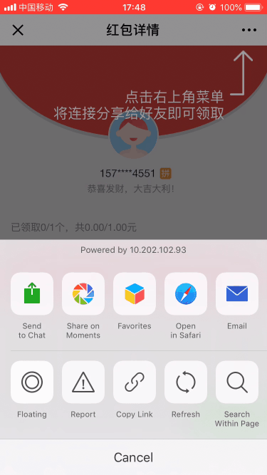

# 记录

>记录项目工作中遇到的问题


### VH
- 【问题】： CSS中使用了VH，在iOS中展示正常，但是在安卓的个别浏览器中，当输入框弹出时，使用VH的DIV的高度会发生变化。
- 【原因】： 在安卓端浏览器虚拟键盘弹出时，导致视口高度改变，以至于vh的取值改变；页面中使用vh定高的元素的大小被压缩，造成布局错位以及文字溢出。
    ```
    // 正常模式下
    100vh = document.documentElement.clientHeight;

    // 安卓端弹出虚拟键盘情况下
    100vh = document.documentElement.clientHeight - 虚拟键盘的高度;
    ```
- 【解决】： 使用rem/px进行布局暂时修复
<br>

#### 补充 
- vw：viewpoint width，视窗宽度，1vw等于视窗宽度的1%。
- vh：viewpoint height，视窗高度，1vh等于视窗高度的1%。
- vmin：vw和vh中较小的那个。
- vmax：vw和vh中较大的那个。
- px：绝对单位，页面按精确像素展示
- em：相对单位，基准点为自身或父节点字体的大小
- rem：相对单位，可理解为”root em”，相对根节点html的字体大小来计算


### react 错误提示
- `Super expression must either be null or a function, not undefined`单词拼写错误，例如`Component`写成了`Components`


### 手机自动识别手机的功能关闭
- iPhone手机浏览器在加载网页的时候，会把疑是手机号或者电话号的一串数字加上一个连接，点了之后会弹出拨打号码的窗口。
- 将手机自动识别手机的功能关闭：<meta name="format-detection" content="telephone=no" />
- 如果你还想要识别手机号的功能可以这样：<a href="tel:15*******60">15*******60</a>

### 手机兼容性问题：页面空白问题
- 问题描述：个别苹果6s和6，app中的H5页面点击进去是空白的，但在大部分的手机上，没有问题
- 拿到白屏页面手机后，将此H5页面在微信以及其他浏览器中打开，均空白，排除APP因素。
- 采用抓包工具，查看打印台，报错：`SyntaxError: Unexpected token '*'. Expected an opening '(' before a function's parameter list.`
- 通过报错和排查得知，webpack在打包编译JS代码时，转换成Generator和yield的代码，在问题机型上无法被正确解析。

### 下拉加载
- `mobile.ant.design`的下拉刷新在手机上滑动会有阻塞感，体验不好，如果去除容器`wrapper`的`height`，`scroll`会走`window`滑动顺畅，但是滑动到底部时，向上滑动时会走刷新。
- 使用过`vue`的`mint-loadmore`，并没有这种问题，所以将代码改写成react，发现上述问题还是存在，最终通过在`touch`事件触发时，判断`window.scrollY`的值来确定是否触发刷新的代码。

### window.location.href无效，页面不跳转
- 在`react`的`componentDidMount`中使用，判断是否在finance的APP中，如果是，则执行`window.location.href`授权登录，线上发现该行代码不生效，最终使用将之放在`function`中。


### npm(淘宝依赖)、npm(原生翻墙)、cnpm、yarn
-  react版本号，`package` `^16.0.0`与`package-lock` `^15.6.2`中不统一的情况下（最新`^16.5.0`），用这几种方式下载的版本号差别。
-  npm(淘宝依赖)： `^16.0.0` (`package` )
-  npm(原生翻墙)： `^15.6.2` (`package-lock` )
-  cnpm： `^16.5.0` (最新)
-  yarn： `^16.0.0` (`package` )
> 知识点记录：<br>
`package-lock.json`： 是在 `npm install`时候生成一份文件，用以记录当前状态下实际安装的各个npm package的具体来源和版本号。<br>
向上标号`^`是定义了<strong>向后（新）兼容依赖</strong>。向新兼容依赖下载最新库包。例如 `^16.0.0`，`^16.5.0`。<br>
package.json文件只能锁定大版本，也就是版本号的第一位，并不能锁定后面的小版本。因此npm 5的版本以上就开始提供自动生成`package-lock.json`功能，为的是让开发者知道只要你保存了源文件，到一个新的机器上、或者新的下载源，只要按照这个`package-lock.json`所标示的具体版本下载依赖库包，就能确保所有库包与你上次安装的完全一样。<br>
在以前可能就是直接改package.json里面的版本，然后再npm install了，但是5版本后就不支持这样做了，因为版本已经锁定在package-lock.json里了，所以我们只能npm install xxx@x.x.x  这样去更新我们的依赖，然后package-lock.json也能随之更新。


### npm本地安装后，启动报错。Module build failed: Error: Couldn't find preset "react" relative to directory "user/adela"
- 描述：项目中node_modules中安装成功了，但是启动报错。
- 在根目录下安装了react等

### 接口404解决方案
- 描述：谷歌浏览器打开接口，404，后端说没有访问日志。
- 解决：
    1. 尝试了其他浏览器，发现请求的通，怀疑是谷歌浏览器缓存问题。打开谷歌的无痕模式，发现在接口请求的通，401。
    2. 转在项目中，还是404，再三检查代理配置，排除配置错误原因。同时在其他电脑上尝试，发现浏览器可以打开401，项目中404。
    3. 在浏览器中模拟登录状态，发现在未登录时，401，存在token的情况下，404。
    4. 跟后端反应，检查以后，发现开发服Nginx配置有问题。
- 总结: 发生接口404时的可能原因：1、浏览器缓存。2、前端代理配置。3、服务端代理配置。4、后端代码问题。


### localhost，127.0.0.1 和 本机IP 三者的区别。
- 描述：使用webpack开启本地服务，如果port为127.0.0.1，则无法使用WIFI(本机)的ip地址，看到开启的服务。改成localhost或者0.0.0.0以后，才可以。
- 疑问：那么localhost，127.0.0.1 和 本机IP 三者有什么区别？
- 回答：
    1. localhost：本地服务器， 不经过网卡传输，不受网络防火墙和网卡相关的限制，不会解析成ip，不会占用网卡和网络资源。
    2. 127.0.0.1：本机地址（本机服务器）， 需要通过网卡传输，收到网络防火墙和网卡相关的限制，
    3. 本机IP：本机有三块网卡，虚拟网卡(loopback)、有线网卡(ethernet)、无线网卡(wlan)。本机IP为真实网卡的IP
- 总结：一般设置程序时，本地服务用localhost比较好，不会解析成IP，不会占用网卡和网络资源。所以有时候使用localhost可以，但是127.0.0.1不可以的情况就在于此。localhost访问时，系统带本机当前用户的权限去访问，而使用IP的时候，等于本机通过网络再去访问本机，可能涉及网络用户的权限。

 : | localhost | 127.0.0.1 | 本机IP
---|-----------|-----------|------
网络|不联网|不联网|联网
传输|不用网卡，不受防火墙和网卡限制|网卡传输，受防火墙和网卡限制|网卡传输，受防火墙和网卡限制
访问|本机访问|本机访问|本机或外部访问

通过本机host文件，可以将localhost解析为127.0.0.1，也可以修改是别的IP地址，本质上是个域名

----------

参考文档：
- [localhost与127.0.0.1的区别](https://www.cnblogs.com/zengkefu/p/4991315.html)
- [127.0.0.1和localhost和本机IP三者的区别](https://www.cnblogs.com/austinspark-jessylu/p/6923781.html)


### 微信端autofocus虚拟键盘弹出拉高页面

可以看到在微信端打开我的收银台页面，点击下一步时，会弹出支付密码弹窗，再点击关闭的时候，整个页面都会向上滑。这显然是不正常的。


首先采用的方法是，input失去焦点或者点击支付密码弹窗左上角X的时候，使用scrollTop定位到页面顶部。

```js
document.documentElement.scrollTop = document.body.scrollTop = 0
```


可以看到画面更加魔幻了。有一个页面被虚拟键盘向上推起，又被scroll拉下来的动画。

同时，我们也有一个疑问，为什么我们明明只是关闭了支付密码的弹窗，会有虚拟键盘弹出来，拉高页面。看了弹窗的相关代码。

```js
<input type="password" placeholder="请输入支付密码" onChange={this.handleChange.bind(this)}  autoFocus />
```

从代码中可以看到，input中有autoFocus，可以自动聚焦，并唤起虚拟键盘。

查阅资料可知：IOS下input的获取焦点存在这样的问题

> 来自FastClick团队的大牛指出了IOS下input的获取焦点存在这样的问题：my colleagues and I found that iOS will only allow focus to be triggered on other elements, from within a function, if the first function in the call stack was triggered by a non-programmatic event. In your case, the call to setTimeout starts a new call stack, and the security mechanism kicks in to prevent you from setting focus on the input.


最后采用的方案是微信中不自动聚焦。判断是否在微信浏览器中`navigator.userAgent.toLowerCase().includes('micromessenger')`，如果是的话，就将autoFocus设为false。


### 小程序跳H5token问题
- 【问题】微信小程序跳H5，token从URL上传递，H5获取到token以后，塞入cookie。在本地localhost环境下可以识别，在测试环境pay.tairamall.com中不行。
- 【解决】通过跟电商小程序开发人员沟通得知，塞到cookie中 必须指定域名.tairanmall.com，指定路径为/。采用以下代码解决。

```js
let Days = 1,exp = new Date();
exp.setTime(exp.getTime() + (expire ? expire : Days) * 24 * 60 * 60 * 1000);
document.cookie = name + "=" + encodeURI(value) + ";expires=" + exp.toGMTString() + ";domain=.tairanmall.com;path=/";
```

- 【注意】上述代码无法在localhost域名下指定cookie的domain。localhost上的工作时，cookie的域必须设置为“”或NULL或FALSE。

可查看摘录集中对于cookie知识的摘录【cookie入门】

### 微信分享测试环境分享
- 【问题】：在测试环境中，微信分享分享给好友的链接是当前页面的链接，期望为接口返回的特定链接。
- 【解决】：
    1. 在测试反馈给我这个问题的时候，我先去正式环境看了一下，没有这个问题。
    2. 回想了一下近期代码的更改，也没有涉及到相关的更改。
    3. 得出初步结论：可能是测试环境配置的问题，造成分享不正确。不过虽然大概率是测试配置原因，问题还是需要定位的，看什么原因造成测试环境有问题。连上
    4. 连上抓包软件charles，进行查看，发现getJSApi返回502，这个接口的完整地址是`https://wx.tairanmall.com/getJSApi`。所以应该是测试的代理不对。果然，连上了以后就请求通了。
    5. 以为这样就可以了。但是我还是太天真了。虽然在微信开发者工具中，分享一切正常！但是在手机中，还是有问题，分享不出去！
    6. 暂定是getJSApi返回的信息有问题。过了一天，测试通过了，但是没有任何改动。。。emmmmm

    
    

    从上述gif中可以看到，开发者工具中，可以正确获取到分享标题等信息。而且在控制台中可以看到相关操作例如取消和发送的时候，打印出的信息。而在手机微信中，控制台中是没有信息的。而且接口也都是获取到的。基本上问题就集中在下面代码中。

    我们在手机中alert(mainTitle)，alert(url)，都有弹窗出来。而在wx.onMenuShareAppMessage这一步就走不通了。暂定疑问在wx.config中，因为getJSApi接口返回的数据，不能被wx.config通过。

    ```js
    wx.config({
        debug: false, // 开启调试模式,调用的所有api的返回值会在客户端alert出来，若要查看传入的参数，可以在pc端打开，参数信息会通过log打出，仅在pc端时才会打印。
        appId: res.data.appId, // 必填，公众号的唯一标识
        timestamp: res.data.timestamp, // 必填，生成签名的时间戳
        nonceStr: res.data.nonceStr, // 必填，生成签名的随机串
        signature: res.data.signature,// 必填，签名，见附录1
        jsApiList: [
            'hideMenuItems',
            'onMenuShareAppMessage',
            'onMenuShareTimeline',
            'onMenuShareQQ',
            'onMenuShareQZone',
            'onMenuShareWeibo'
        ] // 必填，需要使用的JS接口列表，所有JS接口列表见附录2
    });
    wx.ready(function(){
        wx.onMenuShareAppMessage({
            title: mainTitle, // 分享标题
            desc: subTitle, // 分享描述
            link: url,// 分享链接，该链接域名或路径必须与当前页面对应的公众号JS安全域名一致
            imgUrl: imgUrl, // 分享图标
            type: '', // 分享类型,music、video或link，不填默认为link
            dataUrl: '', // 如果type是music或video，则要提供数据链接，默认为空
            success: function () {
                // 用户确认分享后执行的回调函数

            },
            cancel: function () {
                // 用户取消分享后执行的回调函数

            },
            fail: function () {
                // 用户取消分享后执行的回调函数

            }
        });
        wx.onMenuShareTimeline({
            title: mainTitle, // 分享标题
            link: url, // 分享链接，该链接域名或路径必须与当前页面对应的公众号JS安全域名一致
            imgUrl: imgUrl, // 分享图标
            success: function () {
                // 用户确认分享后执行的回调函数
            },
            cancel: function () {
                // 用户取消分享后执行的回调函数
            }
        });
        wx.onMenuShareQQ({
            title: mainTitle, // 分享标题
            desc: subTitle, // 分享描述
            link: url, // 分享链接
            imgUrl: imgUrl, // 分享图标
            success: function () {
                // 用户确认分享后执行的回调函数
            },
            cancel: function () {
                // 用户取消分享后执行的回调函数
            }
        });
        wx.onMenuShareWeibo({
            title: mainTitle, // 分享标题
            desc: subTitle, // 分享描述
            link: url, // 分享链接
            imgUrl: imgUrl, // 分享图标
            success: function () {
                // 用户确认分享后执行的回调函数
            },
            cancel: function () {
                // 用户取消分享后执行的回调函数
            }
        });
        wx.onMenuShareQZone({
            title: mainTitle, // 分享标题
            desc: subTitle, // 分享描述
            link: url,  // 分享链接
            imgUrl: imgUrl, // 分享图标
            success: function () {
                // 用户确认分享后执行的回调函数
            },
            cancel: function () {
                // 用户取消分享后执行的回调函数
            }
        });
    });
    ```

### npm run error
- 【问题】：在 npm run dev ，发生报错，报错如下
```
cross-env NODE_ENV=development node server/server.js

server dev
events.js:165
      throw er; // Unhandled 'error' event
      ^

Error: listen EADDRINUSE 0.0.0.0
    at Server.setupListenHandle [as _listen2] (net.js:1325:19)
    at listenInCluster (net.js:1383:12)
    at Server.listen (net.js:1482:5)
    at Application.listen (/Users/adela/mater/todo-ssr/node_modules/koa/lib/application.js:65:19)
    at Object.<anonymous> (/Users/adela/mater/todo-ssr/server/server.js:29:5)
    at Module._compile (module.js:649:30)
    at Object.Module._extensions..js (module.js:660:10)
    at Module.load (module.js:561:32)
    at tryModuleLoad (module.js:501:12)
    at Function.Module._load (module.js:493:3)
Emitted 'error' event at:
    at emitErrorNT (net.js:1362:8)
    at process._tickCallback (internal/process/next_tick.js:114:19)
    at Function.Module.runMain (module.js:692:11)
    at startup (bootstrap_node.js:194:16)
    at bootstrap_node.js:666:3
```

- 【解决】： 打开终端，输入

```
ps -ef|grep node
```
查看端口号情况，如下
```
  501  3315  3314   0 10:34上午 ttys000    0:00.11 node /Users/adela/mater/todo-ssr/node_modules/.bin/cross-env NODE_ENV=development node server/server.js
  501  3316  3315   0 10:34上午 ttys000    0:04.21 node server/server.js
  501  3419  3322   0 10:35上午 ttys003    0:00.00 grep --color=auto --exclude-dir=.bzr --exclude-dir=CVS --exclude-dir=.git --exclude-dir=.hg --exclude-dir=.svn node
```
在终端输入：```skill -9 3316```把这几个端口占用都杀死


### 微信小程序中打开H5页面，出现反复跳登录页情况
- 【问题】：微信小程序中打开H5页面，出现反复跳登录页情况。通过对其他机型的测试，其中有几个华为手机基本百分百出现，vivo手机没有，苹果手机也没有。19年3月25日解决。
- 【过程】：微信小程序的token是放在URL上传递到H5中的，H5的处理是先通过`window.__wxjs_environment === 'miniprogram'`判断是否在小程序中，如果是，再获取到URL上的token，塞到cookie中。猜想原因：可能是因为是否是小程序中判断有误。
- 【解决】：将问题机型，在测试环境复现以后，通过修改`window.__wxjs_environment === 'miniprogram'`的判断方式为验证URL是否携带`token`，经过测试，解决了这个问题。我们在问题机型和正常机型中，将`window.__wxjs_environment === 'miniprogram'`的结果打印出来，在正常机型中为true，在问题机型中为false，因此，可以判断，的确是这个方法`window.__wxjs_environment === 'miniprogram'`存在问题。
