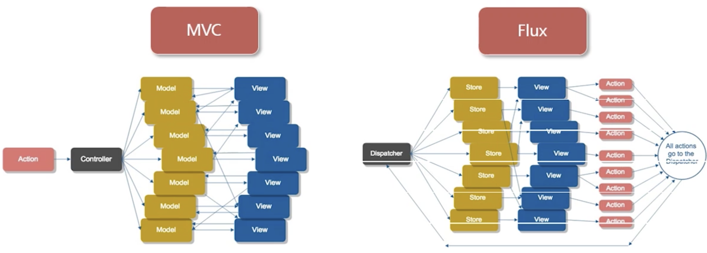
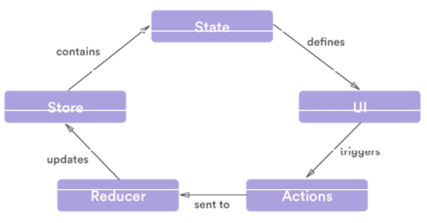
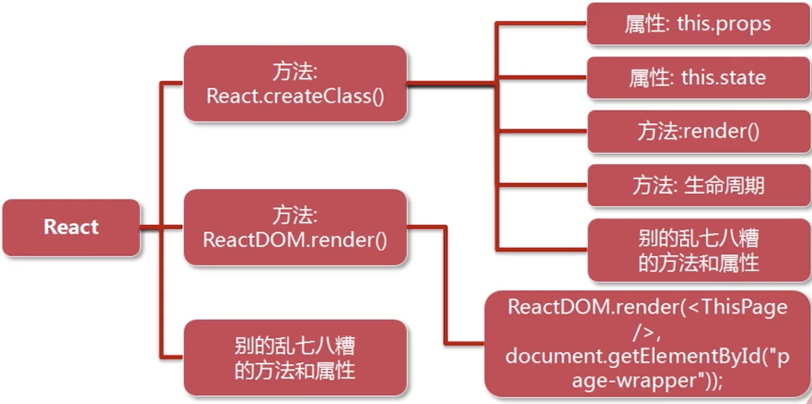
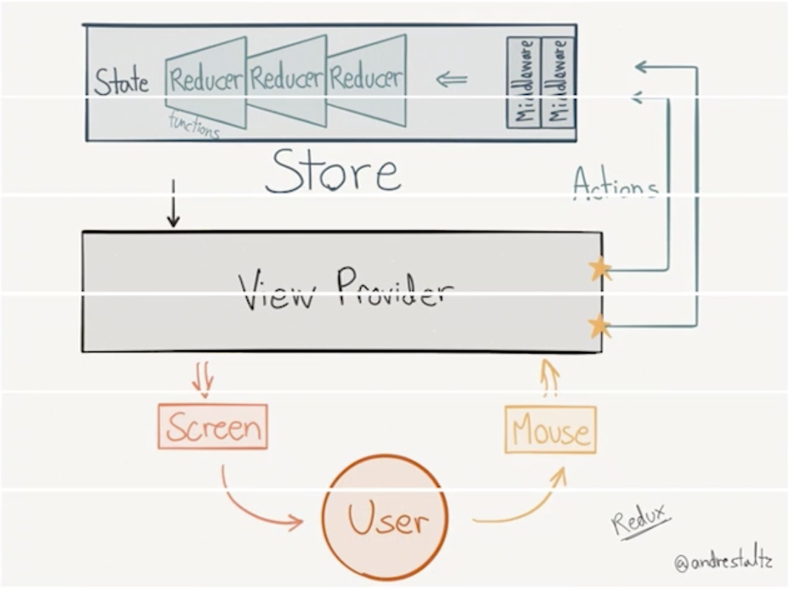

# 在React中使用Redux数据流

知识点记录

***
---

### 数据流是什么？为什么要用数据流？
- 数据流是我们的行为与响应的抽象（例如用户输入表单，页面根据用户行为响应，进行数据更新）
- 使用数据流帮助我们明确了行为对应的响应（状态可预测）

### React与数据流的关系
- React是纯V层的框架，需要数据流进行支撑

### 单向数据流
- MVC：数据放model中，用view来显示，Controller做整体管理。缺点：当系统庞大时，若有一个Action作用在controller，会分发到各个model，系统状态会变得不可预测。（例如下一个订单，用户账户、优惠信息、物流信息等model会变化，view界面也会相应变化。）
- Flux: 用户会有多种action行为，用一个统一的dispatcher进行分发。一个action分发到若干个store，store保存着数据和页面状态。根据用户的行为和页面状态。store只能向视图层传递信息，而不允许视图层反作用store上
 

### Redux概述
- 当页面渲染完以后，UI出现；用户触发UI上的Action；Action被传送到Reducer方法中去；Reducer会更新Store；state是Store的一部分；组件内容由State来唯一决定
 

### React的简单回顾
- 面对对象：方法和属性的组合
- react由三个部分组成：
    * 1、创建一个组件React.createClass()；
        - 【属性】this.props: 父子组件之间传递属性
        - 【属性】this.state: 组件本身的状态
        - 【方法】render(): JSX渲染
        - 【方法】生命周期: componentDidMount...
    * 2、组件渲染到一个节点上ReactDOm.render()；
    * 3、其他方法和属性 
 

### React-redux
- 安装：npm install react-redux redux
    * redux是独立的工作流
    * react-redux实际是redux的react绑定，利用react实现redux的工作流
- react-redux框图
    * user在页面中点击鼠标，view会产生action，action传递到store中去，reducer决定了action和state，state再影响view
 

### 项目结构
- actions
- components
- container
- reducer
- index.html
- server.js
- webpack

#### actions
- 行为的抽象
- 普通的JS对象
- 一般由方法生成
- 必须有一个type

#### reducer
- 响应的抽象
- 纯方法（纯方法：完全根据输入可以得出输出； 非纯方法：例如项目要依赖当前的时间、系统的状态）
- 传入旧状态和action
- 返回新状态

#### store
- action作用于store
- reducer根据store响应
- store是唯一的
- store包括了完整的state
- state完全可预测

### 组件
|#|container|component|
|---|---|---|
|目的|如何工作（数据获取，装填更新）|如何显示（样式，布局）|
|是否则Redux数据流中|是|否|
|读取数据|从Redux获取state|从props获取数据|
|修改数据|向Redux派发actions|从props调用回调函数|
|实现方式|由react-redux生成|手写|

