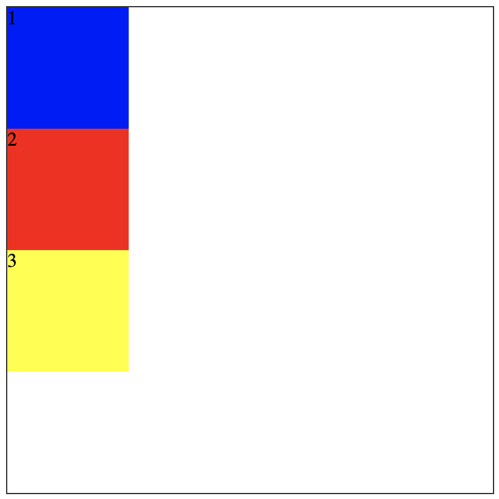
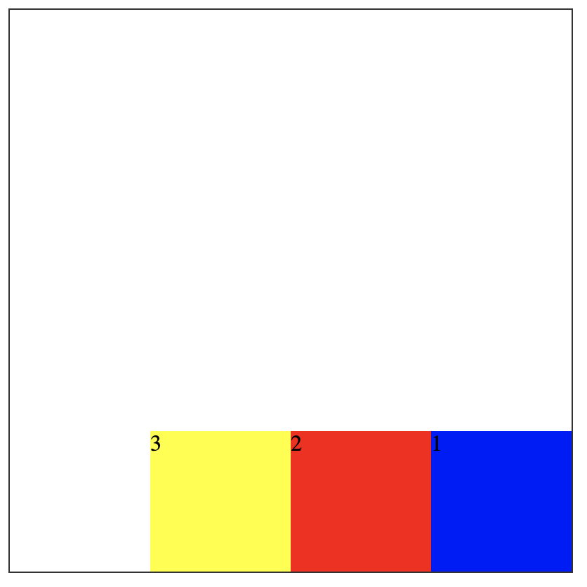

#### 2. flex 弹性盒布局


将图片1写成图片2
```html
  <style>
    .container{
      width: 400px;
      height: 400px;
      border: 1px solid #333;
    }
    .box{
      width: 100px;
      height: 100px;
      background: blue;
    }
    .box:nth-child(2){
      background: red;
    }
    .box:nth-child(3){
      background: yellow;
    }
  </style>
  <div class="container">
    <div class="box">1</div>
    <div class="box">2</div>
    <div class="box">3</div>
  </div>
```
在上述HTML代码上加上
```css
.container{
    display: flex;
    align-items: flex-end;
    flex-direction: row-reverse;
}
```
