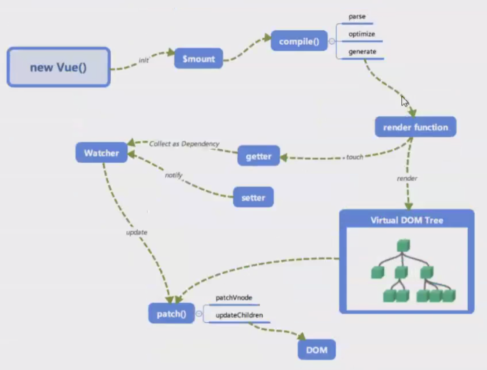
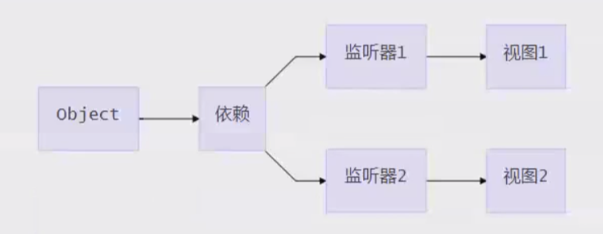

# Vue 源码解析

### Vue 的工作机制



在 `new vue()` 之后，Vue 会调用进行初始化，会初始化生命周期、事件、props、methods、data、computed和watch等。其中最重要的是通过`Object.defineProperty`设置`setter`和`getter`，用来实现`响应式`和`依赖收集`。

初始化之后，调用 `$mount` 挂载组件。

启动编译器`compile()`，对template进行扫描，parse、optimize、generate，在这个阶段会生成渲染函数或更新函数，`render function`，生成虚拟节点数，将来我们改变的数据，并不是真的DOM操作，而是虚拟DOM上的数值。

在更新前，会做一个diff算法的比较，通过新值和老值的比较，计算出最小的DOM更新。执行到`patch()`来打补丁，做界面更新，目的是用JS计算的时间换DOM操作的时间。因为页面渲染很耗时间，所以vue的目的就是减少页面渲染的次数和数量。

`render function`除了编译渲染函数以外，还做了一个依赖搜集（界面中做了很多绑定，如何知道和数据模型之间的关系）。当数据变化时，该去界面中更新哪个数据节点。通过观察者`watcher()`来调用更新函数`patch()`

### 编译

编译模块分为三个阶段

1. parse 使用正则解析template中vue的指令变量等，形成语法树AST
2. optimize 标记一些静态节点，用作后面的性能优化，在diff的时候直接略过
3. generate 把第一步生成的AST转化为渲染函数render function

### 响应式

vue 核心内容

初始化的时候通过defineProverty进行绑定，设置通知机制，当编译生成的渲染函数被实际渲染时，会触发getter进行依赖收集，在数据变化时，通过setter进行更新。

### 虚拟DOM

virtual DOM 是react首创，Vue2开始支持，用js对象来描述DOM结构，数据修改的时候，先修改虚拟DOM中的数据，然后数组做diff，最后再汇总所有的diff，力求做最少的dom操作，毕竟js里对比很快，而真实的dom操作太慢。

```javascript
{
  tag: 'div',
  props: {
    name: 'xx',
    style: {color: red},
    onClick: xx
  },
  children: [{
    tag: 'a',
    text: 'click me'
  }]
}
```

```html
<div name="xx" style="color: red" @click="xx">
  <a>click me</a>
</div>
```

### 更新视图
数据修改触发setter，然后监听器会通知进行修改，通过对比两个DOM树，得到改变的地方，就是patch，只需要把这些差异修改即可。


## Vue2响应式的原理： defineProperty

```html
 <div id="app"><div id="name"></div></div>

  <script>
    let obj = {}
    Object.defineProperty(obj, 'name', {
      get: function() {
        return document.querySelector('#name').innerHTML
      },
      set: function(val) {
        document.querySelector('#name').innerHTML = val
      }
    })
    obj.name='adela'
  </script>
```


### 描述vue数据绑定的原理
利用了Object.defineProperty这个属性，将data中的每一个属性，都定义了getter和setter，去监听这些属性的变化，当某些属性变化时，我们可以通知需要更新的地方去更新。[数据劫持]

### 实现数据响应式




增加了一个Dep类，用来搜集Watcher对象。

读数据的时候，会触发getter函数把当前的Watcher对象（存放在Dep.target中）搜集到Dep类中去。

写数据的时候，则会触发setter方法，通知Dep类调用notify来触发所有watcher对象的update方法更新对应视图。


## 检查点
- vue编译过程是怎么样的
vue写的模板语句，HTML不识别，通过编译的过程，进行依赖搜集，data中的数据模型和视图进行了绑定，如果模型发生变化，会通知依赖的地方进行更新，这就是执行编译的目的。模型驱动视图。
- 双向绑定的原理是什么
v-model 的指令放在input上，在编译时，可以解析出v-model。操作时做了两件事情，一，在当前v-model所属的元素上加了一个事件监听，v-model指定的事件回调函数当做input事件回调函数去监听，当input发生变化时，就将值更新到vue实例上。二、vue实例已经实现了数据的响应化，setter函数会触发界面中所有依赖的更新。