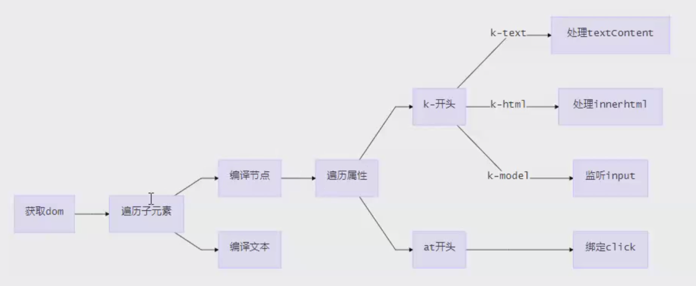

# Vue 源码解析

### Vue 的工作机制


在 `new vue()` 之后，Vue 会调用进行初始化，会初始化生命周期、事件、props、methods、data、computed和watch等。其中最重要的是通过`Object.defineProperty`设置`setter`和`getter`，用来实现`响应式`和`依赖收集`。

初始化之后，调用 `$mount` 挂载组件。

启动编译器`compile()`，对template进行扫描，parse、optimize、generate，在这个阶段会生成渲染函数或更新函数，`render function`，生成虚拟节点数，将来我们改变的数据，并不是真的DOM操作，而是虚拟DOM上的数值。

在更新前，会做一个diff算法的比较，通过新值和老值的比较，计算出最小的DOM更新。执行到`patch()`来打补丁，做界面更新，目的是用JS计算的时间换DOM操作的时间。因为页面渲染很耗时间，所以vue的目的就是减少页面渲染的次数和数量。

`render function`除了编译渲染函数以外，还做了一个依赖搜集（界面中做了很多绑定，如何知道和数据模型之间的关系）。当数据变化时，该去界面中更新哪个数据节点。通过观察者`watcher()`来调用更新函数`patch()`

### 编译

编译模块分为三个阶段

1. parse 使用正则解析template中vue的指令变量等，形成语法树AST
2. optimize 标记一些静态节点，用作后面的性能优化，在diff的时候直接略过
3. generate 把第一步生成的AST转化为渲染函数render function

### 响应式

vue 核心内容

初始化的时候通过defineProverty进行绑定，设置通知机制，当编译生成的渲染函数被实际渲染时，会触发getter进行依赖收集，在数据变化时，通过setter进行更新。

### 虚拟DOM

virtual DOM 是react首创，Vue2开始支持，用js对象来描述DOM结构，数据修改的时候，先修改虚拟DOM中的数据，然后数组做diff，最后再汇总所有的diff，力求做最少的dom操作，毕竟js里对比很快，而真实的dom操作太慢。

```javascript
{
  tag: 'div',
  props: {
    name: 'xx',
    style: {color: red},
    onClick: xx
  },
  children: [{
    tag: 'a',
    text: 'click me'
  }]
}
```

```html
<div name="xx" style="color: red" @click="xx">
  <a>click me</a>
</div>
```

### 更新视图
数据修改触发setter，然后监听器会通知进行修改，通过对比两个DOM树，得到改变的地方，就是patch，只需要把这些差异修改即可。


## Vue2响应式的原理： defineProperty

```html
 <div id="app"><div id="name"></div></div>

  <script>
    let obj = {}
    Object.defineProperty(obj, 'name', {
      get: function() {
        return document.querySelector('#name').innerHTML
      },
      set: function(val) {
        document.querySelector('#name').innerHTML = val
      }
    })
    obj.name='adela'
  </script>
```


### 描述vue数据绑定的原理
利用了Object.defineProperty这个属性，将data中的每一个属性，都定义了getter和setter，去监听这些属性的变化，当某些属性变化时，我们可以通知需要更新的地方去更新。[数据劫持]

## 实现数据响应式


### 监听Observe

增加了一个Dep类，用来搜集Watcher对象。

读数据的时候，会触发getter函数把当前的Watcher对象（存放在Dep.target中）搜集到Dep类中去。

写数据的时候，则会触发setter方法，通知Dep类调用notify来触发所有watcher对象的update方法更新对应视图。


### 编译Compile
核心逻辑获取DOM，遍历DOM，获取{{}}格式的变量，以及每个DOM的属性，截获k-和@开头的设置响应式。



### 检查点
- vue编译过程是怎么样的
vue写的模板语句，HTML不识别，通过编译的过程，进行依赖搜集，data中的数据模型和视图进行了绑定，如果模型发生变化，会通知依赖的地方进行更新，这就是执行编译的目的。模型驱动视图。
- 双向绑定的原理是什么
v-model 的指令放在input上，在编译时，可以解析出v-model。操作时做了两件事情，一，在当前v-model所属的元素上加了一个事件监听，v-model指定的事件回调函数当做input事件回调函数去监听，当input发生变化时，就将值更新到vue实例上。二、vue实例已经实现了数据的响应化，setter函数会触发界面中所有依赖的更新。


### 知识点
```javascript
let fragment = document.createDocumentFragment();
```
fragment 是一个指向空DocumentFragment对象的引用。

DocumentFragments 是DOM节点。它们不是主DOM树的一部分。通常的用例是创建文档片段，将元素附加到文档片段，然后将文档片段附加到DOM树。在DOM树中，文档片段被其所有的子元素所代替。

因为文档片段存在于内存中，并不在DOM树中，所以将子元素插入到文档片段时不会引起页面回流（对元素位置和几何上的计算）。因此，使用文档片段通常会带来更好的性能。

### 代码

#### kvue.js

```javascript
class KVue {
  constructor(options) {
    this.$options = options

    this.$data = options.data
    this.observe(this.$data)

    new Compile(options.el, this)

    if (options.created) {
      options.created.call(this)
    }
  }

  observe(value) {
    if (!value || typeof value !== 'object') {
      return
    }

    Object.keys(value).forEach(key => {
      this.defineReactive(value, key, value[key])
      // 代理data中的属性到vue实例上
      this.proxyData(key)
    })
  }

  defineReactive(obj, key, val) {

    this.observe(val) // 递归解决数据嵌套

    const dep = new Dep() // 初始化dependence

    Object.defineProperty(obj, key, {
      get() {
        Dep.target && dep.addDep(Dep.target)
        return val
      },
      set(newVal) {
        if (newVal == val)
          return
        val = newVal
        console.log(`${key}属性更新了：${val}`)
        dep.notify()
      }
    })
  }

  proxyData(key) {
    Object.defineProperty(this, key, {
      get() {
        return this.$data[key]
      },
      set(newVal) {
        this.$data[key] = newVal
      }
    })
  }
}

// Dep: 用来管理watcher对象。
// 读数据的时候，会触发getter函数，把当前的Watcher对象（存放在Dep.target中）搜集到Dep类中去。
// 写数据的时候，会触发setter方法，通知Dep类调用notify来触发所有watcher对象的update方法更新对应视图。
class Dep {
  constructor() {
    //  这里存放若干依赖（watcheer）
    this.deps = []
  }

  addDep(dep) {
    this.deps.push(dep)
  }

  notify() {
    // 通知所有的依赖去做更新
    this.deps.forEach(dep => dep.update())
  }
}

// Wathcer  
class Watcher {
  constructor(vm, key, cb) {
    this.vm = vm
    this.key = key
    this.cb = cb
    // 将当前watcher实例制定到Dep静态属性target
    Dep.target = this
    this.vm[this.key] // 触发getter, 添加依赖
    Dep.target = null
  }

  update() {
    console.log(`属性更新了`)
    this.cb.call(this.vm, this.vm[this.key])
  }
}
```

#### compile.js

```javascript
class Compile {
  constructor(el, vm) {
    // 要遍历的宿主节点
    this.$el = document.querySelector(el)

    this.$vm = vm

    // 编译
    if (this.$el) {
      // 转换内部内容为片段fragment
      this.$fragment = this.node2fragment(this.$el)
      // 执行编译
      this.compile(this.$fragment)
      // 将编译完的HTML结果追加至$el
      this.$el.appendChild(this.$fragment)
    }
  }
  // 将宿主元素中代码片段拿出来遍历，比较高效
  node2fragment(el) {
    const frag = document.createDocumentFragment()
    // 将el中的所有子元素搬家至frag中
    let child
    while ((child = el.firstChild)) {
      frag.appendChild(child)
    }
    return frag
  }

  // 编译过程
  compile(el) {
    const childNodes = el.childNodes
    Array.from(childNodes).forEach(node => {
      // 判断类型
      if (this.isElement(node)) {
        // 元素
        // console.log('编译元素' + node.nodeName)
        const nodeAttrs = node.attributes
        Array.from(nodeAttrs).forEach(attr => {
          const attrName = attr.name // 属性名
          const exp = attr.value // 属性值
          if (this.isDirective(attrName)) {
            // k-text
            const dir = attrName .substring(2)
            this[dir] && this[dir](node, this.$vm, exp)
          } else if (this.isEvent(attrName)) {
            let dir = attrName.substring(1)
            this.eventHandler(node, this.$vm, exp, dir)
          }
        })
      } else if (this.isInterpolation(node)) {
        // 文本
        // console.log('编译文本' + node.textContent)
        this.compileText(node)
      }
      // 递归子节点
      if (node.childNodes && node.childNodes.length > 0) {
        this.compile(node)
      }
    })
  }

  compileText(node) {
    // console.log(RegExp.$1)
    this.update(node, this.$vm, RegExp.$1, 'text')
  }

  // 更新函数
  update(node, vm, exp, dir) {
    const updaterFn = this[dir + 'Updater']
    // 初始化
    updaterFn && updaterFn(node, vm[exp])
    // 依赖收集
    new Watcher(vm, exp, function(value) {
      updaterFn && updaterFn(node, value)
    })
  }

  text(node, vm, exp) {
    this.update(node, vm, exp, 'text')
  }

  // 事件处理器
  eventHandler(node, vm, exp, dir) {
    let fn = vm.$options.methods && vm.$options.methods[exp]
    if (dir && fn) {
      node.addEventListener(dir, fn.bind(vm))
    }
  }

  html(node, vm, exp) {
    this.update(node, vm, exp, 'html')
  }

  // 双向绑定
  model(node, vm, exp) {
    // 指定input的value属性
    this.update(node, vm, exp, 'model')
    // 视图对模型响应
    node.addEventListener('input', e => {
      vm[exp] = e.target.value
    })
  }

  modelUpdater(node, value) {
    node.value = value
  }

  textUpdater(node, value) {
    node.textContent = value
  }

  htmlUpdater(node, value) {
    node.innerHTML = value
  }

  isDirective(attr) {
    return attr.indexOf('k-') == 0
  }

  isEvent(attr) {
    return attr.indexOf('@') == 0
  }

  isElement(node) {
    return node.nodeType === 1
  }

  isInterpolation(node) {
    return node.nodeType === 3 && /\{\{(.*)\}\}/.test(node.textContent)
  }
}

```
#### index.html

```html
<body>
  <div id="app">
    <p>{{name}}</p>
    <p k-text="name"></p>
    <p>{{age}}</p>
    <p> {{doubleAge}} </p> 
    <input type="text" k-model="name"> 
    <button @click="changeName">click me</button>
    <div k-html="html"></div>
  </div>
  <script src='./compile.js'></script>
  <script src='./kvue.js'></script>

  <script>
    let xx = new KVue({
      el: '#app', 
      data: { 
        name: "I am test.", 
        age: 12, 
        html: '<button>这是一个按钮</button>' 
      }, 
      created() {
        console.log('开始啦')
        setTimeout(() => {
          this.name = '我是测试'

        }, 1500)
      }, methods: {
        changeName() {
          this.name = '哈喽，嘻嘻嘻'
          this.age = 1
          this.id = 'xx'
          console.log(1, this)
        }

      }
    }) 
  </script>
</body>
```