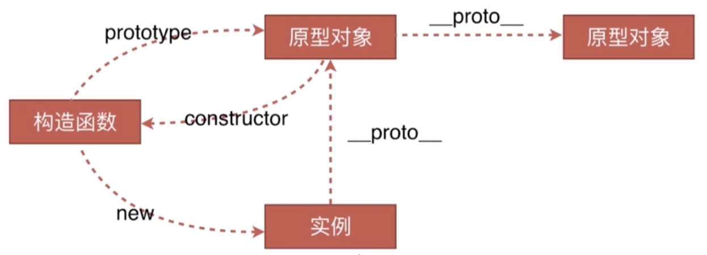
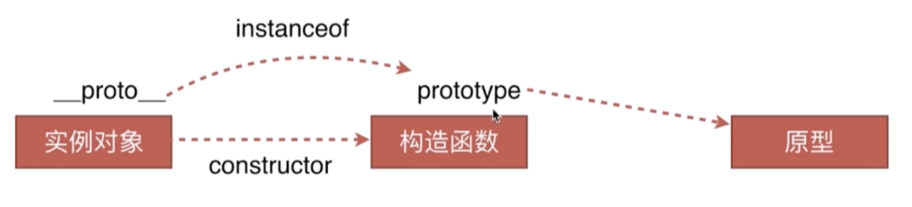
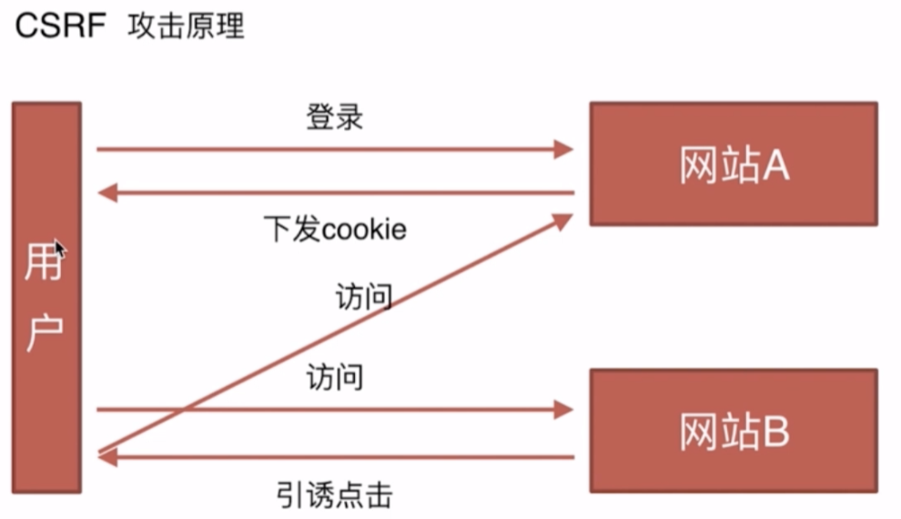
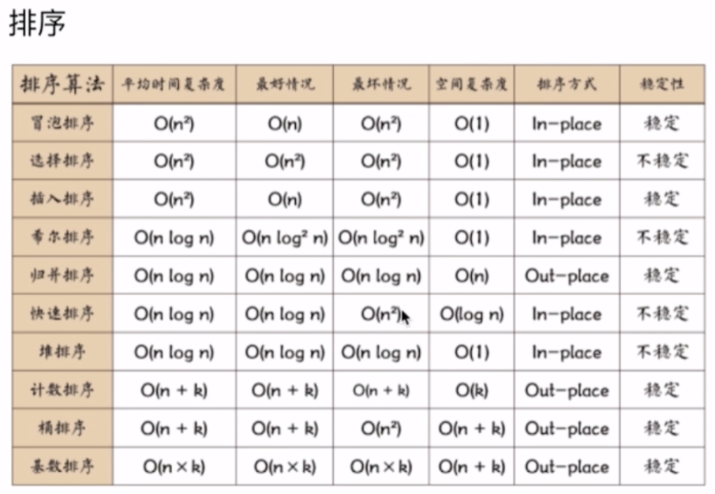
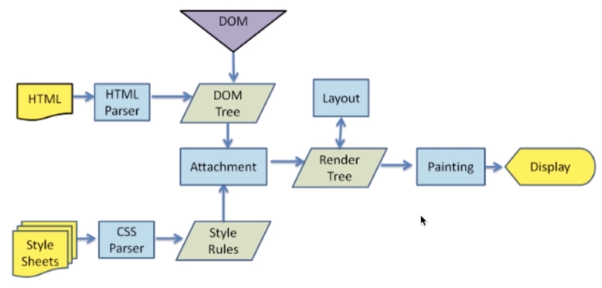
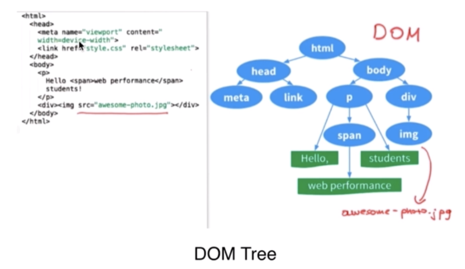
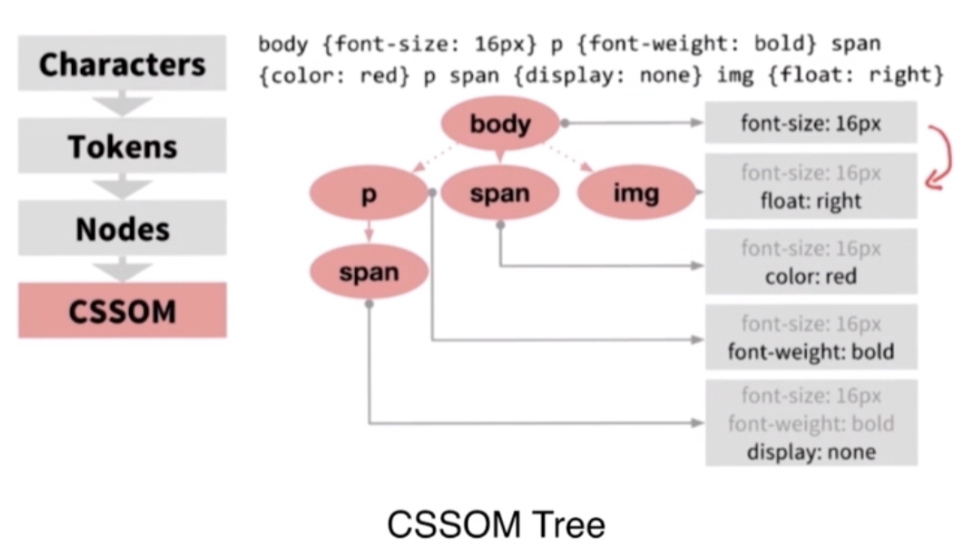
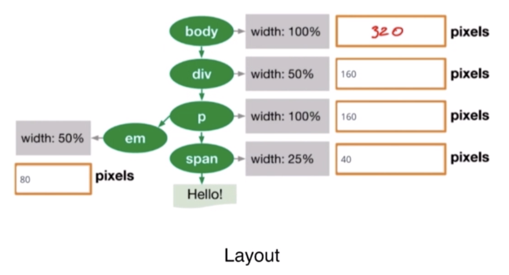
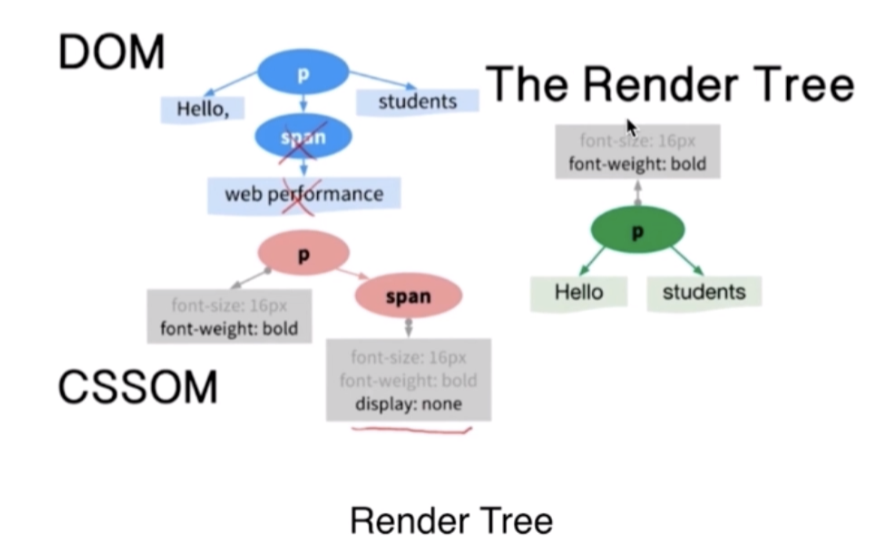

# 总览
一面
1. 页面布局类
2. CSS盒模型、DOM事件类
3. HTTP协议类、原型链类
4. 面向对象类、通信类
5. 前端安全类、前端算法类

二面
1. 渲染机制、js运行机制
2. 页面性能、错误监控
3. MVVM框架类解析
4. 双向绑定、设计模式

三面
1. 面试技巧
2. 业务能力
3. 团队协作能力
4. 带人能力

终面
1. 面试技巧
2. 职业竞争力
3. 职业规划

真题解析
1. 九宫格
2. 阿里笔试题
3. 函数和对象
4. 算法题

## 面试准备

1. 知识：对协议的了解、业务的认识
2. 能力：架构能力、业务抽象能力、项目把控能力，带2-3人快速开发
3. 经验：能力上项目的体验

- 在职业生涯中有么有做过特色业务，角色是什么，推动了什么，改变了什么。
- 在开发中遇到过什么问题。
- 架构分析和设计能力。目录结构、复用性、模块化、自动化测试。代码易读、易维护。
- 成品的体验和可用性。用户研究。某个项目完成了功能，但是做了改进，增强了用户体验。
- 熟悉构建工，webpack，能自己搭建前端构建环境。

1. 职位描述分析
2. 业务分析或实战模拟
3. 技术栈准备
4. 自我介绍

### 业务分析和实战模拟

```html
<meta http-equiv="X-UA-Compatible" content="IE=Edge,chrome=1">
```

使用 meta 元素放入X-UA-Compatible(浏览器兼容模式)  http-equiv 标头，为你的网页指定文件模式。兼容性配置：IE走最高级的Edge去渲染，如果有Chrome浏览器，用Chrome渲染。

```html
<meta name="renderer" content="webkit">
```

双核浏览器： IE webkit 内核。如果是双核浏览器，优先用webkit内核渲染。

```html
<link rel="dns-prefetch" href="//static.360buyimg.com">
```

DNS预解析。为了在加载图片快的时候，第一个优化的点就是DNS预解析


### 简历
- 姓名-年龄-手机-邮箱-籍贯
- 学历
- 工作经历，时间-公司-岗位-职位-技术栈-业绩（给公司做出了什么成绩；攻克了什么难题；哪些地方没有做好，可以准备可以弥补的技术方案）
- 开源项目，GitHub和说明

### 自我陈述
- 把握面试的沟通方向：
    1. 负责了什么项目。这个项目是做什么的，和前端的结合点什么，做的角色是什么，承担了什么责任，做出了什么成绩。
    2. 项目负责人。项目几个人参与、是项目还是技术负责人。做出了怎么样的成绩，项目是怎么分配的，团队间是怎么协作的。技术管理上，怎么解决技术配合和技术难点的。
   （我平时喜欢研究一些网站，喜欢去看技术原理和技术好玩的点。我喜欢思考，也愿意尝试去做更好的方式。）
- 豁达、自信的适度发挥。

## 一面二面
- 沟通简洁、回答灵活、态度谦虚
1. 页面布局
2. css盒模型
3. DOM事件
4. HTTP协议
5. 面向对象
6. 原型链
7. 通信
8. 安全
9. 算法

### 页面布局
flex，float， grid，table-cell，position，优缺点、他们之间的比较，height如果不定义，兼容性。
1. float 浮动，脱离文档流，如果处理不好，会有很多局限性。兼容性比较好。
2. position 绝对定位，高效。脱离文档流。
3. flex 布局，解决了上述的缺点问题，移动端最为常用。
4. table-cell 表格布局，兼容性很好。缺点：历史上的诟病，当中间高度超出时，两边也会变高。
5. grid 网格布局，代码量少，比较新。

### css盒模型
- 分类：标准模型（content）、IE模型(border)
- 区别：不同点在于高度和宽度的不同。
- 设置：使用box-sizing: content-box/border-box
- 获取高宽：
```javascript
dom.style.width/height // 仅内联样式的宽和高
dom.currentStyle.width/height // 渲染以后的宽和高，仅IE
window.getComputedStyle(dom).width/height // 渲染以后的宽和高
dom.getBoundingClientRect().width/height // 元素的left/top/width/height 
```
- 边距重叠：
    1. 父子元素边距重叠
    2. 兄弟元素边距重叠，上下margin重叠取最大值。
- BFC：
    1. 基本概念：块级格式化上下文
    2. 原理-渲染规则：1、垂直方向的边距会发生重叠。2、BFC的区域如果与浮动元素的box重叠，可以清除浮动。3、里外元素不会影响。4、计算BFC高度时，浮动的元素也会参与计算。 
    3. 如何创建BFC：0、overflow：hidden/auto。1、FLOAT不为none。2、position的值不为static和relative。3、display为table/flex/inline-block相关。


### DOM 事件

- 基本概念：DOM事件的级别
```javascript
// DOM0：
element.onclick = function(){}
// DOM2：
element.addEventListener('click', function(){}, false) // false冒泡，true捕获
// DOM3：
element.addEventListener('keyup', function(){}, false) // 增加了事件类型
```
- DOM事件模型：冒泡、捕获
- DOM事件流：浏览器在当前页面与用户交互的过程中，用户行为怎么传到页面上，怎么响应。1、捕获；2、目标阶段：事件通过捕获，到达目标元素；3、冒泡：在从目标元素上传到window对象
- 描述DOM事件捕获的具体流程：window->document->html->body->...->目标元素
- Event对象的常见应用：1、阻止默认行为`event.preventDefault()`；2、阻止冒泡`event.stopPropagation()`；3、事件响应优先级，例如一个按钮依次绑定了两个事件A、B，在A的响应函数中加入这句  话，B点击将不会被执行`event.stopImmediatePropagation()`；4、for循环给DOM注册了安装事件，怎么优化？子元素绑定click事件代理转移到父元素上，响应函数中，需要判断哪一个被点击了。当前被绑定的事件`event.currentTarget`、当前被点击的元素`event.target`。事件代理，事件委托。
- 自定义事件：
```javascript
var eve = new Event('custome'); 
dom.addEventListener('custome', function() { 
console.log('custome'); 
}); 
dom.dispatchEvent(eve);
// CustomEvent与Event差不多，object做参数。
```


### HTTP协议

- HTTP协议的主要特点
    1. 简单快速（每个资源UrI是固定的）、
    2. 灵活（每个HTTP协议中有一个头部分，会有数据类型。通过一个HTTP协议就能传输不同数据类型）、
    3. 无连接（连接一次就会断掉）、
    4. 无状态（从HTTP上不能区别两次连接的状态）

- HTTP报文的组成部分
    1. 请求报文：请求行（http方法、页面地址、HTTP协议、版本）、请求头（key、value值，告诉服务端要哪些内容）、空行(告诉服务器下面应该当做请求体来解析)、请求体。
    2. 响应报文：状态行（HTTP协议及版本、HTTP状态码）、响应头、空行、响应体。

- HTTP方法
    get获取资源、post传输资源、put更新资源、delete删除资源、head获得报文首部

- POST和GET的区别
    - `GET在浏览器回退时是无害的，而POST会再次提交请求`
    - GET产生的URL地址可以被收藏，而POST不可以
    - `GET请求会被浏览器主动缓存，而POST不可以，除非手动设置`
    - GET请求只能进行URL编码，而POST支持多种编码方式
    - `GET请求参数会被完整保留在浏览器历史记录里，而POST中的参数不会被保留`
    - `GET请求在URL中传送的参数是有长度限制的，而POST没有限制`
    - 对参数的数据类型，GET只接受ASCII字符，而POST没有限制
    - GET比POST更不安全，因为参数直接暴露在URL上，所以不能用来传递敏感信息
    - `GET参数通过URL传递，POST放在Request body中`

- HTTP状态码
    - 1xx: 指示信息-表示请求已接收，继续处理
    - 2xx: 成功-表示请求已被成功接收
    - 3xx: 重定向-要完成请求必须更进一步的额操作
    - 4xx: 客户端错误-请求语法错误或者请求无法实现
    - 5xx: 服务器错误-服务器未能实现合法请求
    ```
    200 OK: 客户端请求成功
    206 Partial Content: 客户发送了一个带有Range头的GET请求，服务器完成了它
    301 Moved Permanently: 所请求的页面已经转移至新的URL 【永久重定向】
    302 Found: 所请求的页面已经临时转移至新的URL【临时重定向】
    304 Not Modified: 客户端有缓冲的文档并发出了一个条件性的请求，服务器告诉客户，原来缓存的文档还可以继续使用
    400 Bad Request: 客户端请求有语法错误，不能被服务器所理解
    401 Unauthorized: 请求未经授权，这个状态码必须和WWW-Authenticate报头域一起使用
    403 Forbidden: 对被请求页面的访问被禁止
    404 Not Found: 请求资源不存在
    500 Internal Server Error: 服务器发生不可预期的错误原来缓存的文档还可以继续使用
    503 Server Unavailable: 请求未完成，服务器临时过载或当机，一段时间后可能恢复正常
    ```

- 持久连接
    - HTTP协议采用“请求-应答”模式，每个请求/应答客户和服务器都要新建一个连接，完成之后立即断开
    - 当使用Keep-Alive模式时，客户端到服务端的连接持久有效，当出现对服务器的后继请求时，Keep-Alive功能避免了建立或者重新建立连接，HTTP1.1版本才有
- 管线化
    - 在使用持久连接的情况下，某个连接消息的传递类似于：请求1->响应1->请求2->响应2->请求3->响应3
    - 某个连接上的消息变成了类似这样：请求1->请求2->请求3->响应1->响应2->响应3

    - `管线化机制通过持久连接完成，仅HTTP/1.1支持此技术`
    - `只有GET和HEAD请求可以进行管线化，而POST则有所限制`
    - `初次创建连接时不应启动管线机制，因为对方服务器不一定支持HTTP/1.1版本的协议`
    - 管线化不会影响响应到来的顺序
    - HTTP/1.1要求服务器端支持管线化，但不要求服务器端也对响应进行管线化处理，只是要求对于管线化的请求不失败即可
    - 由于上面提到的服务器端问题，开启管线化很可能并不会带来大幅度的性能提升，而且很多服务器和代理程序对于管线化的支持并不好，因此现代浏览器如Chrome和Firefox默认并未开启管线化支持
    

### 原型链
- 创建对象有几种方法
- 原型、构造函数、实例、原型链
- instanceof的原理
- new运算符

#### 创建对象有几种方法
1、创建对象有几种方法：1、字面量。2、构造函数。3、Object.create
```javascript
var o1 = {name: 'o1'}; var o11 = new Object({name: 'o11'});
var M = function () {this.name = 'o2'}; var o2 = new M();
var P = {name: 'o3'}; var o3 = Object.create(P); // 创建的对象是用原型链进行连接的
```

#### 原型、构造函数、实例、原型链



#### instanceof的原理

- 用 constructor 来判断比 instanceof 更加严谨
```javascript
o2 instanceof M // true
o2 instanceof Object // true

o2.__proto__ === M.prototype // true
M.prototype.__proto__ === Object.prototype // true

o2.__proto__.constructor === M // true
o2.__proto__.constructor === Object // false
```

#### new运算符
1. 一个新对象被创建，它继承自foo.prototype
2. 构造函数foo被执行，执行的时候，相应的传参会被传入，同时上下文this会被指定为这个新实例。new foo等同于new foo()，只能用在不传递任何参数的情况
3. 如果构造函数返回了一个“对象”，那么这个对象会取代整个new出来的结果。如果构造函数没有返回对象，那么new出来的结果为步骤1创建的对象
```javascript
let new2 = function(func) {
    let o = Object.create(foo.prototype)
    let k = func.call(o)
    if (typeof k === 'object') {
        return k
    } else {
        return o
    }
}
```


### 面向对象
- 类与实例：类的声明、生成实例
```javascript
// 类的声明
function Animal () {
  this.name = 'name';
}
// es6中的class声明
class Animal2 {
  constructor () {
    this.name = name;
  }
}
// 实例化
new Animal(), new Animal2()
```

- 类与继承：如何实现继承、继承的几种方式
```javascript
// 借助构造函数实现继承：1、原理。2、缺点：部分继承，在构造函数中的属性能够继承，原型链上的不能继承。
function parent1 () {
  this.name = 'parent1'
}
function child1 () {
  parent1.call(this);  // 将父级构造函数this指向子构造函数的实例上，父级中的构造函数子类中也有。
  this.type = 'child1';
}

// 借助原型链实现继承：1、原理。2、缺点：例如 实例两个对象时，因为引用同一个对象，原型链中的原型对象两者是共同用的，改变一个时，另一个也会改变。
function parent2 () {
  this.name = 'parent2';
}
function child2 () {
  this.type = 'child2';
}
child2.prototype = new parent2();

// 组合方式实现继承：通过原型链和构造函数组合的方式，弥补了两者的不足，保留两者的优点。缺点：parent3执行了两次。
function parent3 () {
  this.name = 'parent3';
}
function child3 () {
  parent3.call(this);
  this.type = 'child3';
}
child3.prototype = new parent3;

// 组合方式实现继承优化1：1、构造函数体内，通过两个构造函数组合，能拿到所有构造函数的属性方法。想继承父类的原型对象，赋给子类父类的原型对象就行。2、不足：new child4().constructor === parent4
function parent4 () {
  this.name = 'parent4';
}
function child4 () {
  parent4.call(this); // 在实例化子类的时候，执行一次父类的实例化
  this.type = 'child4';
}
child4.prototype = parent4.prototype; // 对象上只是一次简单的引用，不会再次执行父类的构造函数

// 组合方式实现继承优化2： 
function parent5 () {
  this.name = 'parent5';
}
function child5 () {
  parent5.call(this);  
  this.type = 'child5';
}
child5.prototype = Object.create(parent5.prototype);  //Object.create创建一个中间对象， Object.create创建的原型对象就是参数，父类和子类对象的隔离。
Child5.prototype.construtor = child5;
```

### 通信类
- 什么是同源策略及限制
- 前后端如何通信
- 如何创建Ajax
- 跨域通信的几种方式

#### 什么是同源策略及限制
同源限制策略限制`从一个源加载的文档或者脚本如何与来自另一个源的资源进行交互`。这是一个用于`隔离潜在恶意文件`的关键的安全机制。
- Cookie、LocalStorage和IndexDB无法读取。
- DOM无法获得。
- AJAX请求不能发送    
`协议、域名、端口`构成一个源

#### 前后端如何通信：
- AJAX (同源)；
- WebSocket（不受同源的限制）; 
- CORS（支持同源、支持跨域。CORS允许任何类型的请求，CORS需要浏览器和服务器同时支持，它允许浏览器向跨域服务器发出XMLHttpRequest请求，从而克服了AJAX只能同源使用的限制。）

#### 如何创建Ajax
XMLHTTPRequest对象的工作流程、兼容性处理、事件的触发条件、事件的触发顺序
```javascript
function xml(opt) {
    var xml = XMLHttpRequest ? new XMLHttpRequest() : new window.ActiveXObject('Microsoft.XMLHTTP')
    let {type, url, data} = opt
    type = type.toUpperCase()

    let dataArr = []
    for(var k in data) {
        dataArr.push(k + '=' + data[k])
    }

    if (type === 'GET') {
        url = url + '?' + dataArr.join('&')
        xhr.open(type, url, true)
        xhr.send()
    }
    if (type === 'POST') {
        xhr.open(type, url, true)
        xhr.setRequestHeader('Content-type', 'application/x-www-form-urleencoded')
        xhr.send(dataArr.join('&'))
    }

    xhr.onload = function () {
        if (xhr.status === 200 || xhr.status === 304) {
            let res
            if (opt.success && opt.sucess instanceof Function) {
                res = xhr.responseText
                if (typeof res === 'string') {
                    res = JSON.parse(res)
                    opt.success.call(xhr, res)
                }
            }
        } else {
            if (opt.error && opt.error instanceof Function) {
                opt.error.call(xhr, res)
            } 
        }
    }
}
```


#### 跨域通信的几种方式
- JSONP
- Hash（hash改变，页面不刷新）
- postMessage（hmtl5中新增加的，用来实现跨域）
- WebSocket（不受同源限制）
- CORS（支持跨域通信的AJAX，浏览器会拦截AJAX请求，如果是跨域的，在HTTP头中加一个origin）

##### JSONP
jsonp的实现原理，script标签的异步加载。
```javascript
util.jsonp = (url, onsuccess, onerror, charset) => {
    let callbackName = url.getName('tt_player')
    window[callbackName] = function () {
        if (onsuccess && onsuccess instanceof Function) {
            onsuccess(arguments[0])
        }
    }
    let script = util.createScript(url + '&callback=' + callbackName, charset)
    script.onload = script.onreadystatechange = function () {
        if (!script.readyState || /loaded|complete/.test(script.readyState)) {
            script.onload = script.onreadystatechange = null
            // 移除该script的DOM对象
            if(script.parentNode) {
                script.parentNode.removeChild(script)
            }
            // 删除函数或变量
            window[callbackName] = null
        }
    }
    script.onerror = function () {
        if (onerror && onerror instanceof Function) {
            onerror()
        }
    }
    document.getElementsByTagName('head')[0].appendChild(script)
}
util.createScript = (url, charset) => {
    let script = document.createElement('script')
    script.setAttribute('type', 'text/javascript')
    charset && script.setAttribute('charset', charset)
    script.setAttribute('src, url)
    script.async = true
    return script
}
```
1. 浏览器用加载script标签的方式，给服务端发请求（回调名jsonp等）。创建一个json全局函数
2. 服务器返回js块内容（回调名和代码），调用jsonp函数就能运行了。
```html
<script src="http://www.abc.com/?data=name&callback=jsonp" charset="utf-8"></script>
<script>
    jsonp({data: {}})
</script>
```

##### Hash
利用hash，场景是当前页面A，通过iframe或frame嵌入了跨域的页面B
```javascript
// 在A中伪代码如下
var B = document.getElementByTagName('iframe')
B.src = B.src + '#' + 'data'
window.onhashchange = function () {
    var data = window.location.hash
}
```

##### postMessage
```javascript
// 窗口A(http://A.com)向跨域的窗口B(http://B.com)发送信息
Bwindow.postMessage('data', 'http://B.com') // B窗口下的window
// 在窗口B中监听
window.addEventListener('message', function(event) {
    console.log(event.origin) // http://A.com
    console.log(event.source) // Awinodw
    console.log(event.data) // data!
}, false)
```

##### WebSocket
```javascript
var ws = new WebSocket('wss://echo.websocket.org') // ws或者wss(加密)，后面指向服务器的地址
ws.onopen = function (evt) {
    console.log('Connection open...')
    ws.send('Hello WebSocket!')
}

ws.onmessage = function (evt) {
    console.log('Received Message: ' + evt.data)
    wx.close()
}

ws.onclose = function (evt) {
    console.log('Connection closed')
}
```

##### CORS
参考资料： http://www.ruanyifeng.com/blog/2016/04/cors.html
```javascript
var ws = new WebSocket('wss://echo.websocket.org') // ws或者wss(加密)，后面指向服务器的地址
fetch('/some/url', {
    method: 'get'
}).then(res => {}).catch(err => {})
```

### 安全类
- CSRF、XSS

#### CSRF

攻击原理：用户为网站A的注册用户，通过登录，在浏览器中存储cookie。用户访问B网站，下发页面中有指向网站A漏洞api的链接，引诱用户点击，浏览器自动上传cookie，网站A确认通过，造成CSRF攻击。
1. 基本概念和缩写：`跨站请求伪造`（Cross-site request forgery）
2. 攻击原理：接口存在漏洞、确实登陆过。
3. 防御措施：Token验证、Referer（页面来源）验证、隐藏令牌。

#### XSS
1. `跨域脚本攻击`（cross-size scripting）
2. 攻击原理（页面注入脚本，不需要登录）。
3. 防御措施。

---------------------------------

##### 了解XSS的定义
##### 理解XSS的原理
##### 理解XSS的的攻击方式
- 反射型：
    发出请求时，XSS代码出现在URL中，作为输入提交到服务器端，服务器端解析后响应，XSS代码随响应内容一起传回给浏览器，最后浏览器解析XSS代码，整个过过程像一次反射，故叫反射型XSS。
- 存储型
    存储型XSS赫恩反射型XSS的差别仅在于，提交的代码会存储在服务器端（数据库，内存，文件系统等），下次请求目标页面时不用再提交XSS代码。
##### 掌握XSS的防御措施
- 编码
    - 对用户输入的数据进行HTML Entity 编码
- 过滤
    - 移除用户上传的DOM属性，如onerror等
    - 移除用户上传的style节点、script节点、iframe节点等
- 校正
    - 避免直接对HTML Entity解码
    - 使用DOM Parse转换，校正不配对的DOM标签


#### 区别
XSS： 向页面注入js运行，在js函数体中做攻击。
CSRF：利用你本身的漏洞，帮你自动执行那些接口，依赖用户登录。

### 算法类
- 1、排序。
- 2、堆栈、队列、链表。
- 3、递归。
- 4、波兰式或逆波兰式。

#### 排序

快速、选择、希尔、冒泡


## 二面三面
- 知识面要广
- 理解要深刻
- 内心要诚实
- 态度要谦虚
- 回答要灵活
- 要学会赞美

1. 渲染机制
2. js运行机制
3. 页面性能
4. 错误监控

### 1. 渲染机制
1、什么是DOCTYPE及作用。2、浏览器渲染过程。3、重排Reflow。4、重绘Repaint。5、布局Layout

#### 1、什么是DOCTYPE及作用。
`DTD`（document type definition，`文档类型定义`）是一系列的语法规则，用来定义XML或者HTML的文件类型。浏览器会使用它来`判断文档类型，决定使用何种协议来解析`，以及切换浏览器模式。
`DOCTYPE`是用来`声明文档类型和DTD规范`的，一个主要的用途便是文件的合法性验证。如果文件代码不合法，那么浏览器解析时便会出差错。

#### 2、浏览器渲染过程。

1. 浏览器渲染页面，涉及html、css、js，影响最后页面的呈现形式。
2. HTML经过HTML Parser转成DOM Tree，CSS按照css规则和解释器转成CSSOM Tree。这两个树整合Attachement，形成Render Tree，告诉浏览器，渲染树的结构完成。RenderTree 不包含具体内容，也不知道位置是什么。
3. 通过layout，精确计算要显示的DOM，具体宽高颜色等，在RenderTree中呈现出来。
4. 最后开始Painting，并display。




#### 3、重排Reflow。
- 定义：DOM结构中的各个元素都有自己的盒子（模型），这些都需要浏览器根据这种样式来计算并根据计算结果将元素放到它该出现的位置。这个过程称为reflow。
- 触发Reflow
1. 当你增加、删除、修改DOM节点事，会导致Reflow或者Repaint。
2. 当你移动DOM的位置，或者搞个动画的时候。
3. 当你修改CSS样式的时候。
4. 当你Resize窗口的时候（移动端没有这个问题），或者滚动的时候。
5. 当你修改网页的默认字体的时候。

#### 4、重绘Repaint。
- 定义：当各种盒子的位置、大小以及其他属性，例如颜色、字体大小等都确定下拉后，浏览器于是把这些元素都按照各自的特性绘制了一遍，于是页面的内容出现了，这个过程称之为repaint。
- 触发：DOM/CSS改动。


### 2. js运行机制
1. 理解JS的单线程概念；
2. 理解任务队列；
3. 理解事件循环Event Loop; 
4. 理解哪些语句会放入异步任务队列；
5. 理解语句放入异步任务队列的时机
异步任务： setTimeout 和 setInterval、DOM事件、ES6中的Promise

1. 运行栈运行同步任务，浏览器遇到异步任务例如setTimeout时，浏览器把异步任务拿走，先留着，setTimeout设置的时间到了以后，放在任务队列中。
2. 当运行栈空了，就去任务队列中读，setTimeout函数内容放在运行栈中，执行。
3. 运行栈又空了以后，继续去任务队列中读，如此循环，叫事件循环。

### 3. 页面性能

- 提升页面性能的方法有哪些？
1. 资源压缩合并，减少HTTP请求
2. 非核心代码异步加载 => 异步加载的方式 => 异步加载的区别
3. 利用浏览器缓存 => 缓存的分类 => 缓存的原理
4. 使用CDN
5. 预解析DNS 
#### 5. 预解析DNS 
```html
<!-- 页面中所有的A标签在浏览器中默认打开DNS预解析，但是如果是https协议，很多游览器是默认关闭的，如果加上第一句话，那么就会全部预解析。 -->
<!-- 强制打开a标签的DNS解析。 -->
<meta http-equiv=”x-dns-prefetch-control” content=”on”>
<!-- DNS 预解析 -->
<link rel=”dns-prefetch” href=”//host_name_to_prefetch.com”>
```

#### 2. 异步加载

- 一、异步加载的方式：
1. 动态脚本加载；
2. defer；
3. async；
- 二、异步加载的区别：
1. defer是在HTML解析完之后才会执行，如果多个，按照加载的顺序执行。
2. async是在加载完之后立即执行，如果是多个，执行顺序和加载顺序无关。


#### 3. 浏览器缓存

- 1、缓存的分类（http头）
1. `强缓存`：资源文件在浏览器中存在的备份，放在磁盘上，下次直接读取。
	- `Expires`（一般是服务器时间，绝对时间） Expires:Thu,21 Jan 2017 23:39:02 GMT
	- `Cache-Control`（相对时间） (Cache-Control: max-age=3600)3600秒
2. `协商缓存`：浏览器发现本地有副本，但不知道有没有过期，需要询问浏览器。
	- `Last-Modified`(服务器下发的) `If-Modified-Since`（浏览器自带的） Last-Modified: Wed,26 Jan 2017 00:35:11 GMT 
    - `Etag`（传递是哈希值，服务器下发时，） `If-None-Match`
Etag解决的问题：修改时间变了，强缓存失效，但是内容没有变化，完全可以从副本拿。


### 4. 错误监控（如何保证产品的质量）
- 前端错误的分类、
- 错误的捕获方式、
- 上报错误的基本原理

#### 前端错误的分类：
- 及时运行错误：代码错误；
- 资源加载错误；

#### 错误的捕获方式：
- 及时运行错误：
1. try…catch;；
2. window.onerror（不能捕获资源加载错误）

- 资源加载错误：
1. object.onerror；
2. performance.getEntries()；返回成功加载的资源组成的数组
3. Error事件捕获 
```javascript
window.addEventListener('error', function(e) {
    console.log('捕获', e)
}, true)
```
4. 延伸：跨域的js运行错误可以捕获吗，错误提示什么，应该怎么处理？
可以捕获。有错误信息：Script error，但是没有出错行号和出错列号。
- 客户端：在script标签增加crossorigin属性
- 服务端：设置js资源响应头Access-Control-Allow-Origin: *

#### 上报错误的基本原理：
1、采用AJAX通信的方式上报
2、利用image对象上报
```html
<script>
    // 发送一个请求，资源向上报
	(new Image()).src=”http://baidu.com/test.js?t=sjdkf”
</script>
```

## 三面
- 准备要充分
- 描述要演练
- 引导找时机
- 优势要发挥
- 回答要灵活

1. 业务能力
2. 团队协作能力
3. 事务推动能力
4. 带人能力
5. 其他能力

1. 我做过什么业务（一两句话描述）
2. 负责的业务有什么业绩（量化：用户量增加、性能提升多少、收入增加多少）
3. 使用了什么技术方案（技术栈）
4. 突破了什么技术难点
5. 遇到了什么问题
6. 最大的收获是什么

## 终面
1. 乐观积极
2. 主动沟通
3. 逻辑顺畅
4. 上进有责任心
5. 有主张，做事果断

1. 职业竞争力
2. 职业规划

