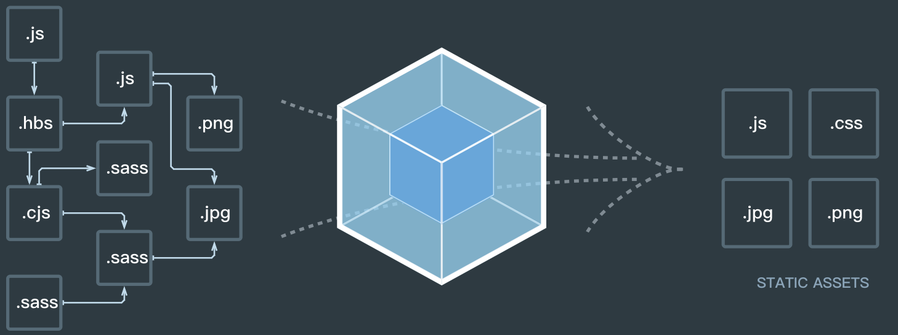

# webpack
 
### webpack 是什么？
 
一个打包工具。

### 为什么我们需要打包？
前端开发越来越复杂，不可能将所有代码都写在同一个文件中，为了方便管理和组织，需要将代码划分到不同的模块或文件中，但是浏览器在加载代码时，不可能单独加载每个模块，这样加载的速度会很慢，这些代码需要被打包成一个或者几个文件，压缩代码提高加载的速度。希望使用ES6或者jsx等，也需要使用打包工具。
- 模块化
- 优化加载速度
- 使用新的开发模式

### webpack有什么新特性

>同时支持CommonJS 与 AMD 
>一切都可以打包 
>分模块打包

`webpack` VS `require.js`
- CommonJS & AMD
- NPM
- Community

`webpack` VS `browserify`
- CommonJS & AMD
- NPM
- Bundle
- File Type